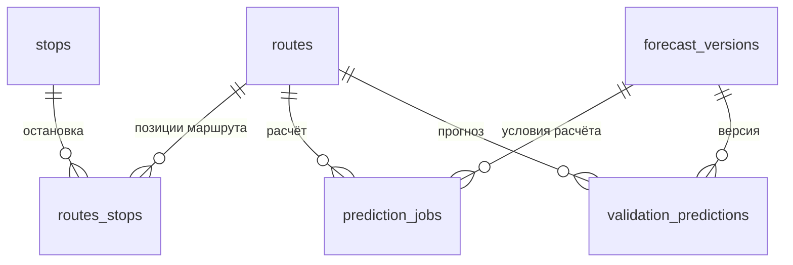
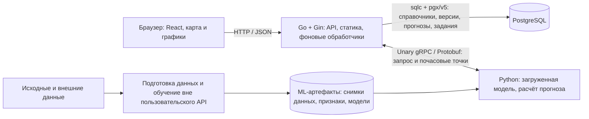

# TramCast — контракт разработки

Этот файл задаёт согласованные требования и правила работы для всего репозитория TramCast. Используй его при проектировании, написании миграций, генерации sqlc и Protobuf, разработке Go, Python и интерфейса. Описание сервиса для читателя находится в [README.md](README.md), подробная раскладка backend — в [backend/README.md](backend/README.md).

## Правила работы

### Взаимодействие

- Не пиши код без ведома пользователя. Перед написанием кода представляй подробный план действий.
- После изменения кода в итоговом ответе предлагай одно краткое сообщение коммита.
- Не создавай коммит без явной просьбы пользователя.
- Формулируй сообщение коммита в стиле существующей истории Git.

### Применение контракта

- Соблюдай описанные ниже границы MVP, схему данных, контракты и правила публикации. Текущие указания Романа имеют приоритет над прежними проектными решениями; отражай изменённые решения в этом файле.
- Актуальные условия и принятые решения имеют приоритет над исходной постановкой в приложении. Рекомендованный там Java-стек, годовой горизонт и детализация по остановкам не расширяют согласованный MVP.
- Храни подробные требования в AGENTS.md. README.md оставляй кратким: назначение, возможности, стек, архитектура, структура и ссылки на документацию.
- Различай согласованное поведение, существующую реализацию и измеренные результаты. Перед изменениями проверяй фактическое состояние файлов; не выдавай план или целевую метрику за готовую возможность.

### Работа с кодом и схемой

- Используй простую структуру `core` и `features`: `routes`, `stops`, `forecasts`, `web`, `catalog` (импорт справочников). Сервис размещай в подкаталоге `service/` фичи, HTTP-код — в `transport/http`, SQL и доступ к БД — в `repository/postgres`. Отдельная иерархия `ports/adapters` для MVP не требуется.
- Имена Go-пакетов строй из пути через `_`, как в проекте Задачник: `core_config`, `core_logger`, `core_postgres`, `core_http_server`; в фичах — `<фича>_service`, `<фича>_transport_http`, `<фича>_sqlc` (имя sqlc-пакета задаётся в `backend/sqlc.yaml`). Импортируй такие пакеты с псевдонимом, равным имени пакета. Исключение — сгенерированный gRPC-пакет `forecastv1`: его имя задаёт контракт в `proto/`.
- В каждой фиче цепочка одна: обработчик → сервис → хранилище. Для фич с БД хранилище — sqlc: сервис объявляет нужную ему часть sqlc как небольшой интерфейс, который напрямую реализует сгенерированный `*Queries`. Для `web` хранилище — `fs.FS` со сборкой фронтенда; у `catalog` кроме sqlc есть хранилища чтения книги XLSX и снимка OSM по путям из конфигурации. Обработчик зависит только от интерфейса сервиса и не обращается к хранилищу напрямую, даже если сервис пока лишь передаёт вызов дальше.
- Рукописные модели приложения размещай в `backend/internal/core/domain`, когда появятся общие бизнес-типы и правила; сейчас там только пакет `core_domain` с правилом идентификаторов источников справочников (префикс `osm:`), общим для `catalog` и `routes`. Не дублируй модели sqlc ради отдельного слоя. Модели строк БД оставляй внутри соответствующей фичи; обёртки над каждым методом sqlc не обязательны. Рукописный репозиторий нужен для преобразований, ошибок и транзакций.
- Источник правды для схемы БД — SQL-миграции в `backend/migrations`. `goose create` создаёт заготовку: DDL в `Up` и обратные действия в `Down` пишутся вручную. Уже применённую схему изменяй новой миграцией.
- SQL-запросы пиши в `repository/postgres/queries` каждой фичи. Конфигурация `backend/sqlc.yaml` использует общие миграции и отдельные блоки генерации в `repository/postgres/sqlc` с `sql_package: pgx/v5`. Сгенерированные файлы вручную не редактируй.
- `sqlc generate` генерирует Go-код из схемы и запросов; `goose up` отдельно применяет миграции к БД. Доменные Go-структуры не генерируют схему. При развёртывании миграции выполняются отдельным шагом перед запуском новой версии backend.
- Исходный Protobuf-контракт храни в корневом `proto/`. Go-модуль размещай в `backend/`; сгенерированный Go-код должен входить в этот модуль, Python-код — в `ml/`.
- Исходники фронтенда размещай в корневом `frontend/`. Go раздаёт сборку `frontend/dist` с диска по пути из `WEB_DIR`; Node нужен на этапе сборки. Встраивание через `go:embed` не обязательно. Правила раздачи находятся в сервисе `web/service` поверх `fs.FS`: нормализация пути без выхода за `WEB_DIR`, `index.html` для путей без расширения (клиентские маршруты, каталоги, `/`), `404` для отсутствующего файла с расширением, типы содержимого и кеширование. `assets/*` Vite кешируются как неизменяемые; остальные файлы, включая `index.html`, получают `no-cache` и ETag по содержимому (sha256), чтобы откат на сборку со старой датой файла не отдавался из кеша. Обработчик пишет ответ через `http.ServeContent` (`304`, `HEAD`, `Range`); путь `/api/...` и JSON-клиенты никогда не получают `index.html`.
- Проверяй изменённое поведение подходящими проверками; для очереди и публикации учитывай перечисленные ниже конкурентные сценарии и сбои. В итоговом ответе указывай, что проверено и какие ограничения остались.

## Состояние проекта

Готовы каркас `backend/`, первая миграция [20260926140649_init_schema.sql](backend/migrations/20260926140649_init_schema.sql), 40 SQL-запросов фич и `backend/sqlc.yaml` для `pgx/v5`. SQL применения/отката и сценарии очереди проверены на отдельной PostgreSQL 18.1, включая параллельные сеансы. Добавлены Docker Compose, Makefile и шаблон окружения для собственной PostgreSQL проекта, миграций и доступа к БД с хоста. Описан общий [Protobuf-контракт `ForecastService.Predict`](proto/README.md), сгенерированы Go-пакеты sqlc и gRPC, создан `backend/go.mod` с Go 1.26.8. Реализован базовый запуск Go: конфигурация окружения, slog, pgxpool, Gin с `/healthz` и `/readyz`, корректная остановка. Добавлены чтение справочников `GET /api/routes`, `GET /api/routes/{route_id}/stops`, `GET /api/stops`, геометрия маршрутов для карты `GET /api/routes/geometry` и фича `web`, которая раздаёт сборку фронтенда из `WEB_DIR`. Реализован импорт справочников из XLSX: команда `backend/cmd/import-catalog` (`make import-catalog`) и фича `catalog`; проверен на отдельной базе PostgreSQL 18.1, включая повторный запуск, конфликты и режим `-dry-run`. Импорт дополняет географию маршрутов 17, 25, 26, 28, 50, которых нет в книге, из снимка OpenStreetMap: снимок хранится в Git в `data/osm/` и читается по пути из `CATALOG_OSM_FILE`, API геометрии указывает источник схемы, а карта показывает его в легенде, подсказке и атрибуции. Импорт из двух источников проверен на отдельной базе PostgreSQL 18.1 в режиме `-dry-run`, при первом и повторном запуске: 15 маршрутов, 731 остановка, 879 позиций, 30 вариантов; повторный импорт ничего не меняет и сохраняет внутренние ID, `GET /api/routes/geometry` возвращает 30 линий — 20 из книги и 10 из OSM. Создан прототип интерфейса в `frontend/` (React, TypeScript, Vite, MapLibre, ECharts): справочники и карта берутся из API, прогноз — детерминированные демо-данные с явной пометкой, кнопки расчёта и выгрузки не подключены. Контекст дизайна описан в [PRODUCT.md](PRODUCT.md). Транзакционные сервисы и API прогнозов, рабочая интеграция gRPC и ML-сервис ещё не реализованы. Обновляй этот статус по мере разработки.

Базовый запуск следует устройству `golang-todoapp` с заменой транспорта на Gin: ручная сборка компонентов в `cmd/tramcast`, конфигурация через envconfig и явный `-env-file`, логирование стандартным slog в stdout. Окружение процесса имеет приоритет над dotenv. `core/repository/postgres` создаёт обычный `*pgxpool.Pool`, проверяет подключение с таймаутом и закрывает пул при ошибке; пул передаётся напрямую в sqlc. HTTP ждёт завершения запросов при SIGINT/SIGTERM, затем закрывается БД. `/healthz` проверяет работу HTTP, `/readyz` выполняет ограниченный по времени Ping PostgreSQL; наличие миграций этот probe не проверяет. Локальный запуск — `make run-backend`; контейнерный — `make app-up` или `docker compose up --build -d --wait`. Dockerfile собирает фронтенд, Go-сервер и импортёр в общий образ. Compose ждёт PostgreSQL, применяет миграции и выполняет первичный импорт перед запуском backend. `go.mod` и `go.sum` приводятся в порядок отдельной целью `make tidy-backend` после изменения импортов или генерации, а не при каждом запуске; `make tidy-backend-check` проверяет это без записи.

Каталог `dataset/` с исходными материалами доступен локально и исключён из Git. Ссылки на него в контракте предполагают, что участник команды получил и разместил данные отдельно. Книга справочников содержит персональные и служебные данные (идентификаторы водителей и госномера в листе `Наряд`, ФИО в метаданных файла), поэтому её не коммитят ни в одном окружении: на сервере файл лежит вне Git, путь задаёт `CATALOG_FILE`. Снимок OpenStreetMap для маршрутов 17, 25, 26, 28, 50, наоборот, хранится в Git в `data/osm/`: ответ `tram_routes.json`, запрос `tram_routes.overpassql` и README. Команда импорта читает его по пути `CATALOG_OSM_FILE` (по умолчанию `../data/osm/tram_routes.json` относительно `backend/`); на сервере файл можно разместить в любом месте, например рядом с книгой, и указать путь в `.env`. Персональных данных в нём нет (запрос без метаданных правок); снимок и полученные из него строки БД распространяются по ODbL 1.0 с указанием «© участники OpenStreetMap».

Контейнерная сборка и запуск проверены в Docker Desktop (Linux/amd64) с отдельными PostgreSQL 18.1 и томами: первый импорт, повторный пропуск без изменения данных и identity, два одновременно ожидающих импортёра (один импорт, один пропуск), откат `-if-empty -dry-run`, отказ запуска backend при повреждённой книге и восстановление после исправления источника. Проверены HTTP-пробы, справочники, геометрия и файлы статики, включая worker MapLibre. Полный набор Go-тестов проходит. В Git остаются исходники фронтенда и lock-файл; `frontend/dist` не коммитится.

## Навигация

- [Условия и ограничения MVP](#актуальные-условия-и-принятые-решения)
- [Шесть таблиц, очередь, gRPC, HTTP API и sqlc](#предметная-область)
- [Сценарии и интерфейс](#какое-решение-строим)
- [Архитектура и стек](#общая-архитектура)
- [Данные](#данные-и-хранение), [ML](#ml-обучение-и-выпуск-прогнозов) и [эксплуатация](#надёжность-и-эксплуатация)
- [Структура проекта](#структура-проекта) и [план MVP](#план-mvp-для-хакатона)
- [Исходная постановка — исторический контекст](#приложение-исходная-постановка)

## Актуальные условия и принятые решения

Источник уточнений — сообщения организаторов, переданные командой в обсуждении проекта. Этот раздел имеет приоритет при расхождении с исходной цитатой и отдельными формулировками [описания датасета](dataset/README.md). Сведения организаторов, допущения проекта и ещё не проверенные оценки обозначены отдельно.

### Период, маршруты и результат

- Фактическая история: **январь–октябрь 2025**. `train.csv` содержит январь–август, `test.csv` — сентябрь–октябрь. После локальной проверки разрешено обучить итоговую модель на обоих файлах.
- Прогноз: **1 ноября — 31 декабря 2025 включительно**, 61 день как продолжение временного ряда. Фактов за этот период нет; организаторы не будут выдавать «вчерашние» значения для расчёта следующего дня.
- Обязательные номера маршрутов: **`1, 5, 7, 11, 12, 17, 25, 26, 28, 50`**. Прогноз по всем 36 городским маршрутам не требуется. Географический справочник организаторов и набор целевых маршрутов имеют разный состав; географию `17, 25, 26, 28, 50` дополняет снимок OpenStreetMap.
- По последнему уточнению организаторов маршрут **№ 5 ошибочный и не имеет истории**, но обязателен в submission. Разрешены виртуальные значения или нули; для MVP выбираем **нулевой fallback**, явно обозначенный в метаданных. Организатор оценил влияние примерно в `0.006`; это не измеренная нами метрика. Формулировка «редко встречается» в описании датасета устарела.
- Единица результата — **маршрут × календарная дата × час**. Минимальный шаг и минимальный интервал просмотра — **1 час**. Полная сетка: **10 × 61 × 24 = 14 640 строк**, включая все ночные часы и 1 464 строки маршрута № 5.
- День показывается по часам; неделя и месяц должны быть доступны **по дням**, с переходом к часам выбранного дня. Это представления одного непрерывного прогноза, а не требование получать новые факты или обучать отдельную модель при каждом переключении.
- Публичные прогнозы и submission содержат **неотрицательные целые числа**, округлённые до ближайшего целого. Соглашение проекта для половин: `0.5 → 1`, `1.5 → 2` (half-up для неотрицательных значений). Суточные и месячные суммы складываются из уже опубликованных почасовых значений.
- Годовой горизонт сохранён в исходной цитате. Его отдельная демонстрация остаётся вопросом к требованиям организаторов; текущий MVP и критерий конкурсной выгрузки ограничены ноябрём–декабрём.

### Очистка, пропуски и внешние данные

- Посадкой считаем **успешную валидацию**: `validation_result == 1`. Обычная оплата и пересадка учитываются одинаково; способ оплаты и тариф сами по себе не исключают успешное событие.
- По уточнению организаторов в labels есть проверки терминалов вне рабочего времени. Их необходимо исключить. Рабочее окно — **с 05:30 до 01:00 следующего дня**, часовой пояс `Europe/Moscow`. Соглашение проекта о точных границах: начало включено, конец исключён. В пределах календарной даты сохраняем события `[00:00, 01:00)` и `[05:30, 24:00)`.
- Фильтруем **сырые события до агрегации**: час `0` рабочий, часы `1–4` вне рабочего окна, в час `5` входят только события начиная с `05:30`. Формат результата остаётся почасовым. Для часов `1–4` сохраняем строки с нулевым прогнозом, а не удаляем их из сетки.
- Готовые labels не позволяют отделить `05:00–05:29` от `05:30–05:59`. Поэтому основной очищенный ряд пересчитывается из raw. При работе только с labels этот час помечается как неподтверждённый и исключается из обучения/оценки до пересчёта; нельзя делить его значение пополам или считать весь час нерабочим. Прогноз часа `5` всё равно обязателен и строится по доступной очищенной истории либо явно указанному резервному методу.
- Пробелы возможны из-за неисправностей валидатора, отсутствия связи, прекращения движения и других причин. **Отсутствие строки не доказывает нулевой спрос.** Наблюдения, частичные счётчики, пропуски, структурные ночные нули и восстановленные оценки различаются. Восстановление пропусков моделью приветствуется организаторами; оценки не подменяют факты и при добавлении просмотра истории должны отображаться отдельно от наблюдений.
- `crd_hashcode` может отличаться для карты и NFC одного человека. Он не является надёжным идентификатором пассажира: не считаем по нему уникальных людей и не удаляем успешные поездки с одинаковым хешем. Технические дубли событий проверяются отдельно.
- Сторонние погода, расписания, автомобильный трафик, календарь и события **разрешены и желательны**, в том числе для отображения в интерфейсе. По уточнению организаторов за описанную ими утечку через внешние данные санкций не будет. Не вводим собственного конкурсного запрета на такие источники, включая ретроспективные сведения; сохраняем ссылки, периоды, снимки и способ использования. Это не означает, что скрытые целевые валидации ноября–декабря доступны.
- Качество улучшаем, пока есть полезные эксперименты и время: score `0.88` не является порогом остановки. В отчёте разделяем измеренный локальный результат, официальный score и предположения.

### Интерфейс и выполнение

- Тёмные подложки, читаемость при масштабировании, однозначные цвета с легендой и минимум действий до нужной информации. Из общей картины дня пользователь открывает маршрут и переключает период, сохраняя контекст.
- Сравнение нескольких прогнозов в разделённых панелях входит в прототип (см. «Интерфейс диспетчера»); адаптация к телефону и планшету в MVP не делается.
- Расчёт отсутствующего прогноза выполняется **асинхронно**: запрос → `job_id` → статус → опубликованный результат. Go управляет заданием в PostgreSQL и вызывает Python по gRPC. Подготовка данных и обучение в MVP выполняются отдельно от пользовательского API; просмотр не запускает повторное обучение.
- При развёртывании предусмотрена базовая аутентификация. Контейнеры имеют доступ в интернет и могут получать внешние данные.
- Координаты храним в обычных полях PostgreSQL, GeoJSON формирует Go. **PostGIS в MVP не используется.** Карта показывает имеющуюся географию справочника организаторов и снимка OpenStreetMap; отсутствие координат не исключает маршрут из прогноза.

## Предметная область

Ниже описана согласованная схема MVP для **одного Go-сервиса, PostgreSQL с заданиями и одного Python gRPC-сервиса**. Структура шести таблиц закреплена в первой SQL-миграции, запросы sqlc и Protobuf-контракт написаны, API справочников с DTO реализован; API прогнозов и транзакционную логику Go ещё предстоит реализовать.

Основной показатель — **число успешных валидаций на маршруте за календарный час после очистки событий вне рабочего окна** (`boardings`). Число людей внутри вагона и процент заполнения из него напрямую не следуют. Прогноз относится к маршруту целиком; остановки и направления нужны для карты.

### Границы MVP и источники

| Таблица | Назначение |
| --- | --- |
| `routes` | Справочник маршрутов |
| `stops` | Справочник остановок |
| `routes_stops` | Последовательности остановок по вариантам движения |
| `forecast_versions` | Модель, исходные данные и поддерживаемый прогнозный период |
| `validation_predictions` | Готовые почасовые значения |
| `prediction_jobs` | Очередь расчётов, попытки и состояние выполнения |

Подготовка данных и обучение выполняются ML-командой вне пользовательского запроса. Сырые события, очищенная история, файлы моделей, снимки внешних источников и отчёты качества остаются ML-артефактами. В этой схеме им не нужны отдельные таблицы. Пользовательские загрузки, обучение из интерфейса, сохранение сценариев и просмотр исторических/внешних рядов — расширения после MVP.

| Источник | Содержимое и использование |
| --- | --- |
| [Описание датасета](dataset/README.md) | Показатель, периоды, метрика и формат конкурсной выгрузки; уточнения организаторов выше имеют приоритет. |
| [Справочники](dataset/spravochniki/Хакатон_справочники_трамвай_10_маршрутов.xlsx) | Листы `Маршруты GTFS_ROUTES`, `Остановки GTFS_STOPS`, `Порядок_остановок GTFS_TRIPS_ST`; источники полей приведены ниже. |
| [train.csv](dataset/train.csv), [test.csv](dataset/test.csv) | События валидации для подготовки истории января–октября 2025 в Python. Суточные хвосты отсекаются по `tran_date_time`. |
| [labels_day_train.csv](dataset/labels/labels_day_train.csv), [labels_day_test.csv](dataset/labels/labels_day_test.csv) | Почасовые агрегаты `route;date;hour;boardings`. Для точной очистки границы 05:30 требуется пересчёт из raw. |
| [test_submission.csv](dataset/test_submission.csv) | Пример прогноза и шаблон сетки `route;date;hour;prediction`, а не фактические наблюдения. |
| [Пример валидаций](dataset/spravochniki/Хакатон_пример_валидаций.xlsx) | Иллюстрация событий с примерами за июль 2026; автоматически не добавляется к истории 2025 года. |
| [Снимок OpenStreetMap](data/osm/README.md) | Ответ Overpass API `tram_routes.json` и запрос `tram_routes.overpassql`: 10 relation `route=tram` (PTv2) маршрутов 17, 25, 26, 28, 50 — по одному на направление, их узлы и родительские `route_master`. Снимок базы OSM на 2026-09-26 22:39:54 UTC; последняя проверка маршрутов по `check_date` — 2023-05-11 (17, 25, 26, 28) и 2025-12-19 (50); соответствие ноябрю–декабрю 2025 не проверено. Хранится в Git в `data/osm/`, импорт читает файл по пути `CATALOG_OSM_FILE`; ODbL 1.0, © участники OpenStreetMap. |
| ML-артефакты и внешние источники | Версии модели, подготовки и данных, очищенная история, снимки внешних признаков, метрики, правила и причины fallback. Их неизменяемые идентификаторы фиксируются в `forecast_versions`. |

В книге справочников есть 10 маршрутов, 489 остановок и 622 позиции в 20 шаблонах движения. С целевыми маршрутами ML пересекаются номера `1, 5, 7, 11, 12`. Географию `17, 25, 26, 28, 50` даёт снимок OpenStreetMap: 5 маршрутов, 242 остановки и 257 позиций в 10 вариантах, по одному на направление. Отсутствие географии по-прежнему не исключает маршрут из прогноза. Лист `Порядок_с_координатами` — объединение порядка остановок с координатами, отдельная таблица не нужна.

При исследовании с книгой сравнивались данные OSM для маршрутов 7 и 11 — отдельный запрос, в снимок они не входят: названия 92–98 % остановок совпадают, медианное расстояние между одноимёнными остановками 10–17 м (максимум около 180 м), порядок остановок одинаковый. Есть и расхождения: в книге есть остановки, которых нет в OSM, у маршрута 11 отличается конечная; причина не установлена. 117 узлов снимка лежат в пределах 50 м от остановок книги и остаются отдельными строками.

Координат событий, `stop_id` в сырых CSV, высадок и точной геометрии рельсовых трасс в наборе нет. Лист `Расписание` содержит фрагмент одного рейса, `Наряд` — записи за 8 февраля 2026; часть справочников актуализирована в 2026 году. География не доказывает соответствия всей истории 2025 года. Снимок OSM тоже не привязан к 2025 году: это состояние базы на 2026-09-26, маршруты по `check_date` проверялись в 2023 и 2025 годах, соответствие ноябрю–декабрю 2025 не проверено. Геометрии путей OSM в снимке нет, поэтому линии этих маршрутов тоже остаются схемой между остановками.

### Общие соглашения

- Поля обязательны (`NOT NULL`), если явно не указано `NULL`. UUID создаёт Go; внутренние числовые ID справочников генерирует PostgreSQL через identity.
- Внутренний ID, номер маршрута и ID источника различаются. Например, у маршрута № 1 исходный `route_id` равен `4450`, а `reg_num` — `932`. Внешний API использует `routes.id`; Python получает `route_number`.
- Справочных источников два: книга организаторов и снимок OpenStreetMap. Идентификаторы источников хранятся как `text`: у книги — исходные числовые ID, у OSM — с пространством имён `osm:` (`osm:node/<id>`, `osm:relation/<id>`), поэтому они не пересекаются. Правило префикса находится в `core_domain`. Остановки не сопоставляются по названию, в том числе между источниками: общая физическая остановка может быть представлена двумя строками. Маршрут, который есть в книге, берётся только из книги.
- Календарный час определяется в `Europe/Moscow`. Моменты времени хранятся как `timestamptz`, дата точки — как `date`. PostgreSQL `timestamptz` не сохраняет название зоны; она задаётся контрактом.
- Интервал `[from, to)` включает начало и исключает конец. Границы конечные, выровнены по целому часу; размер периода ограничен конфигурацией Go.
- **Одна задача — один маршрут на весь горизонт одной версии.** Пользователь выбирает любой непрерывный подынтервал внутри этого горизонта. Даты вне него отклоняются, а не создают произвольные новые версии.
- Версии модели, входных данных и параметры версии прогноза неизменяемы. Новый артефакт или период означает новую запись `forecast_versions`.
- Python округляет прогноз один раз перед выдачей: неотрицательные целые, half-up. Go проверяет значения, не округляет их повторно. Суммы строятся из опубликованных часов.
- Для внешних ключей используется `ON DELETE RESTRICT`. Справочники, версии и задания с зависимыми данными не удаляются неявно.

Пример: интервал `2027-10-28T05:00:00+03:00 → 2027-10-29T01:00:00+03:00` содержит 20 точек: часы 5–23 за 28-е и час 0 за 29-е. Чтобы включить час 1, конец должен быть 02:00. Это иллюстрация формата, а не обещание поддержки моделью 2027 года. Для выбора «05–10 каждого дня» фронтенд фильтрует полученный непрерывный ряд; такой выбор не равен одному непрерывному интервалу.

### Маршрут — `routes`

**Источник:** лист `Маршруты GTFS_ROUTES`; целевые маршруты, которых нет в книге, — снимок OSM (relation `route_master` и relation направлений); номера, которых нет ни в одном источнике, добавляются из целевого набора ML без географии.

| Поле | PostgreSQL | Назначение и источник |
| --- | --- | --- |
| `id` | `bigint`, identity | Внутренний ID приложения. |
| `route_number` | `smallint` | Номер трамвая из `route_short_name`, `ref` relation OSM или `route` ML-данных. |
| `name` | `text`, NULL | Полное название из `route_long_name`; у маршрута из OSM — «первая - последняя остановка» направления 0, по правилу названий книги; может отсутствовать у маршрута без географии. |
| `source_route_id` | `text`, NULL | Исходный `route_id` книги или `osm:relation/<id>` relation `route_master` OSM; не номер трамвая. |
| `forecast_enabled` | `boolean`, default `false` | Разрешён ли прогноз для маршрута в MVP; задаётся Go при подготовке каталога. |

**Ключи и ограничения:** PK `id`; UNIQUE `route_number`; UNIQUE `source_route_id` с допустимыми NULL; `route_number > 0`; заданный `source_route_id` непустой. Номер уникален в рамках проекта с московскими трамваями. Целевые десять маршрутов получают `forecast_enabled = true`.

`forecast_enabled` обозначает доступность функции, а не готовность результата. Внутренний ID и номер сохраняются при обновлении справочника. Фронтенд может обращаться по условному `route_id = 1488`, а Go передаёт Python соответствующий `route_number = 50`; равенство этих значений не предполагается.

### Остановка — `stops`

**Источник:** лист `Остановки GTFS_STOPS`; для маршрутов из OSM — узлы `public_transport=stop_position`, которые входят в relation маршрутов как остановки. Запись обозначает конкретную остановочную точку, включая сторону движения.

| Поле | PostgreSQL | Назначение и источник |
| --- | --- | --- |
| `id` | `bigint`, identity | Внутренний ID приложения. |
| `source_stop_id` | `text` | Идентификатор из `stop_id` книги или `osm:node/<id>`. |
| `name` | `text` | Название из `stop_name` или тега `name` узла OSM; у OSM кавычки «» „“ ” заменяются на `"`, строчная первая буква — на заглавную. |
| `latitude` | `double precision` | Широта из `stop_lat` или `lat` узла OSM. |
| `longitude` | `double precision` | Долгота из `stop_lon` или `lon` узла OSM. |

**Ключи и ограничения:** PK `id`; UNIQUE `source_stop_id`; источник и название непустые; широта в `[-90, 90]`, долгота в `[-180, 180]`. Нефинитные координаты не принимаются.

Название не уникально: одноимённые остановки разных направлений могут иметь разные ID и координаты. Одной остановке не назначается собственный `route_id`, поскольку она может входить в несколько маршрутов. Остановки книги и OSM не объединяются: у физической остановки из обоих источников две строки, и при сравнении таких маршрутов на карте видны два близких кружка.

### Позиция остановки — `routes_stops`

**Источник:** лист `Порядок_остановок GTFS_TRIPS_ST`; для маршрутов из OSM — участники relation направления с ролями остановок. Строка — одно посещение остановки на конкретной позиции варианта движения.

| Поле | PostgreSQL | Назначение и источник |
| --- | --- | --- |
| `route_id` | `bigint` | FK → `routes.id`; определяется через исходный `route_id` или `osm:relation/<id>` `route_master`. |
| `pattern_key` | `text` | Ключ варианта движения из `trip_id`; у OSM — `osm:relation/<id>` relation направления. В этой книге это шаблон, а не отдельная выполненная поездка. |
| `direction_id` | `smallint` | Направление из `direction_id`: 0 или 1. У OSM такого тега нет: два relation маршрута перечислены в `catalog_service.OSMRoutes`, индекс в списке — направление. |
| `stop_sequence` | `integer` | Позиция из `stop_sequence`; у OSM — номер участника-остановки в порядке relation, начиная с 1. |
| `stop_id` | `bigint` | FK → `stops.id`; определяется через `source_stop_id`. |

**Ключи и ограничения:** PK `(route_id, pattern_key, stop_sequence)`; FK на маршрут и остановку; `direction_id IN (0, 1)`; `stop_sequence >= 0`; `pattern_key` непустой.

Порядок чтения — `stop_sequence` внутри выбранного `(route_id, pattern_key)`. Номера позиций могут иметь пропуски. Нельзя объединять направления в одну последовательность или предполагать, что обратное направление получается разворотом прямого.

Остановка может встречаться повторно, поэтому уникальность `(route_id, pattern_key, stop_id)` не вводится. В одном направлении допустимы разные варианты. При импорте Go проверяет одинаковый `direction_id` у всех строк одного `(route_id, pattern_key)`; обычный построчный CHECK не обеспечивает такую межстрочную проверку. У варианта OSM направление одно по построению: оно задаётся для relation целиком.

Отдельной таблицы шаблонов в MVP нет. При появлении собственных атрибутов варианта — названия, сроков действия, расписания — его можно выделить в `route_patterns`.

### Версия прогноза — `forecast_versions`

**Источник:** Go регистрирует согласованный с ML-командой набор параметров. Версия объединяет результаты разных маршрутов, полученные при одинаковых условиях. Её не создаёт каждый пользовательский запрос.

| Поле | PostgreSQL | Назначение |
| --- | --- | --- |
| `id` | `uuid` | Идентификатор версии прогноза. |
| `model_version` | `text` | Неизменяемый ID модели, её настроек и обработки признаков. |
| `dataset_version` | `text` | Неизменяемый ID снимка всех входных данных, влияющих на прогноз, включая внешние признаки. |
| `history_end` | `timestamptz` | Исключительная верхняя граница фактической истории. Предсказанные значения её не сдвигают. |
| `forecast_from` | `timestamptz` | Начало поддерживаемого периода, включительно. |
| `forecast_to` | `timestamptz` | Конец поддерживаемого периода, исключительно. |
| `timezone` | `text`, default `Europe/Moscow` | Календарная зона прогноза. |
| `is_active` | `boolean`, default `false` | Версия по умолчанию для новых пользовательских запросов. |
| `created_at` | `timestamptz`, default `now()` | Время регистрации версии. |

**Ключи и ограничения:** PK `id`; непустые `model_version` и `dataset_version`; конечные временные границы; `history_end <= forecast_from < forecast_to`; прогнозные границы по целому часу; `timezone = 'Europe/Moscow'` для MVP.

Частичный уникальный индекс по `is_active` для строк с `is_active = true` обеспечивает **не более одной** активной версии. Наличие активной версии проверяет Go: индекс допускает отсутствие такой строки. Переключение выполняется одной транзакцией. [Ограничения и частичная уникальность PostgreSQL](https://www.postgresql.org/docs/current/ddl-constraints.html).

После регистрации все параметры, кроме `is_active`, неизменяемы. Подмена содержимого артефакта под прежним ID запрещена; `latest` не является идентификатором снимка. Исправления данных, новая модель, настройки или период создают новую версию.

Активная версия задаёт поддерживаемый горизонт, но может ещё не иметь готовых значений для всех маршрутов. Идентификатор выбранной версии фиксируется в начале HTTP-запроса и возвращается вместе с данными или заданием; последующее чтение использует этот ID даже после переключения активной версии.

Для конкурсной версии: `history_end = forecast_from = 2025-11-01T00:00:00+03:00`, `forecast_to = 2026-01-01T00:00:00+03:00`. Метаданные ML-артефакта фиксируют нулевой fallback маршрута № 5 и причину отсутствия его истории.

### Почасовой прогноз — `validation_predictions`

**Источник:** проверенный ответ Python, сохранённый Go. Одна строка — прогноз маршрута за один календарный час.

| Поле | PostgreSQL | Назначение |
| --- | --- | --- |
| `forecast_version_id` | `uuid` | FK → `forecast_versions.id`. |
| `route_id` | `bigint` | FK → `routes.id`. |
| `date` | `date` | Календарная дата в `Europe/Moscow`. |
| `hour` | `smallint` | Начало часового интервала, 0–23. |
| `boardings` | `bigint` | Число посадок; без значения по умолчанию. |
| `created_at` | `timestamptz`, default `now()` | Время сохранения результата. |

**Ключи и ограничения:** PK `(forecast_version_id, route_id, date, hour)`; FK на версию и маршрут; конечная дата; `hour BETWEEN 0 AND 23`; `boardings >= 0`.

Принадлежность точки периоду версии проверяет Go перед публикацией. Она зависит от другой таблицы и не выражается обычным построчным CHECK. Первичный ключ уже создаёт индекс для основной выборки по версии, маршруту и диапазону дат/часов; дублировать его отдельным индексом не требуется.

Отдельные `id`, `weekday` и `job_id` не нужны. День недели вычисляется из `date` и при необходимости отдаётся фронтенду как 1–7, понедельник–воскресенье. Задание однозначно находится по версии и маршруту. Дата и час — единственный сохранённый временной ключ точки; независимый `hour_start` в эту таблицу не добавляется.

**Ноль — готовый прогноз; отсутствие строки — отсутствие результата.** Сохраняется полная сетка, включая часы 1–4 с нулями и все часы маршрута № 5. На маршрут в конкурсной версии приходится 1 464 строки, на десять маршрутов — 14 640. Час 5 учитывает только рабочую часть начиная с 05:30.

Go всегда сортирует результат по `date, hour`. Суммы за день/неделю/месяц строятся из сохранённых целых часов. Опубликованные значения версии не перезаписываются другим расчётом; исправление выпускается новой версией.

### Задание расчёта — `prediction_jobs`

**Источник:** Go создаёт задание при отсутствии готового результата. Go сам выбирает задания из PostgreSQL, вызывает Python и управляет состоянием; Python не читает очередь и не записывает БД.

| Поле | PostgreSQL | Назначение |
| --- | --- | --- |
| `id` | `uuid` | Идентификатор, возвращаемый фронтенду как `job_id`. |
| `forecast_version_id` | `uuid` | FK → `forecast_versions.id`. |
| `route_id` | `bigint` | FK → `routes.id`. |
| `status` | `text`, default `queued` | `queued`, `running`, `succeeded` или `failed`. |
| `attempt_count` | `integer`, default `0` | Число начатых попыток; одновременно номер текущей/последней попытки. |
| `run_after` | `timestamptz`, default `now()` | Самое раннее время следующего запуска. |
| `lease_until` | `timestamptz`, NULL | До какого времени текущий обработчик владеет заданием. |
| `created_at` | `timestamptz`, default `now()` | Время создания. |
| `started_at` | `timestamptz`, NULL | Начало последней попытки. |
| `finished_at` | `timestamptz`, NULL | Окончательное завершение. |
| `last_error_code` | `text`, NULL | Код последней ошибки. |
| `last_error_message` | `text`, NULL | Внутреннее описание последней ошибки; не выдаётся клиенту без обработки. |

**Ключи и ограничения:** PK `id`; UNIQUE `(forecast_version_id, route_id)` во всех статусах; FK на версию и маршрут; `attempt_count >= 0`; статус из указанного набора. Период берётся из версии и в задании не дублируется.

| Статус | Смысл и состояние полей |
| --- | --- |
| `queued` | Ожидает первого запуска или повтора после `run_after`; `lease_until` и `finished_at` отсутствуют. |
| `running` | Есть `started_at`, действующая аренда и `attempt_count > 0`; `finished_at` отсутствует. |
| `succeeded` | Полный результат опубликован; есть `finished_at`, аренда отсутствует. |
| `failed` | Окончательная ошибка или исчерпание попыток; есть `finished_at`, аренда отсутствует. |

Состояние `running` требует заполненного `lease_until`; действительность аренды проверяется при исполнении, а не CHECK с текущим временем. При повторе `started_at` обновляется; между попытками может сохранять начало последней. Номер попытки монотонно увеличивается и не сбрасывается.

Индексы очереди: `(run_after, created_at)` только для `queued` и `lease_until` только для `running`. Лимит попыток, задержки, размер очереди и число обработчиков задаются конфигурацией Go. История каждой отдельной попытки остаётся в логах; отдельная таблица попыток в MVP не требуется.

### Связи и ответственность



Между заданием и точками нет отдельного FK: они связаны общей парой `(forecast_version_id, route_id)`. Только Go изменяет прикладные таблицы и одной транзакцией обеспечивает соответствие `succeeded` полному опубликованному результату. Таблицы БД не копируются автоматически в HTTP DTO или Protobuf-сообщения.

### Выполнение, повторы и публикация

1. Go проверяет маршрут, `forecast_enabled`, выбранную версию и запрошенный интервал. Границы чтения обязаны находиться внутри горизонта версии.
2. Go читает запрошенные точки, проверяет полноту ожидаемой сетки и возвращает готовый результат. Значение 0 не считается пропуском. При нормальной публикации по целому маршруту частичного пакета в БД не возникает; если у `succeeded` обнаружен пропуск, это ошибка целостности, а не основание молча дополнить версию другим расчётом.
3. Если результата ещё нет, Go атомарно создаёт задание или получает существующее по уникальной паре. Конкурентный запрос не создаёт вторую запись; состояние читается после разрешения конфликта. Проверки SELECT перед обычным INSERT недостаточно.
4. Обработчик короткой транзакцией захватывает доступное `queued`-задание, устанавливает `running`, увеличивает `attempt_count`, записывает `started_at` и `lease_until`. Для нескольких обработчиков подходит `FOR UPDATE SKIP LOCKED`. Сетевая работа начинается после завершения транзакции. [Очереди и SKIP LOCKED](https://www.postgresql.org/docs/current/sql-select.html).
5. Go вызывает Python для полного горизонта версии. Контекст фоновой задачи имеет собственный gRPC deadline и не зависит от HTTP-контекста первого клиента. Пока вызов выполняется, Go продлевает аренду условным обновлением по `id + attempt_count + running` и действующей аренде; потерявший аренду обработчик не может её восстановить сам.
6. Go сверяет фактически использованные модель и данные с закреплённой версией прогноза, проверяет временные границы, выравнивание и точное покрытие часов без дублей, присутствие и неотрицательность значений. Маршрут, задание и номер попытки берутся из контекста вызова Go. Одного сравнения количества строк недостаточно. Неполный или некорректный ответ не публикуется; несовпадение версий артефактов завершает задание неповторяемой ошибкой.
7. Для публикации Go начинает транзакцию, блокирует строку задания, проверяет `running`, номер попытки и неистёкшую аренду. Затем вставляет все точки, переводит задание в `succeeded`, записывает `finished_at`, очищает аренду и прежнюю ошибку, фиксирует транзакцию. При любой ошибке весь пакет откатывается. Блокировка не позволяет переотдать задание во время этой транзакции.
8. Временная ошибка переводит задание обратно в `queued` с задержкой в `run_after`; аренда очищается. Неповторяемая ошибка или исчерпание попыток приводит к `failed`. Оба перехода разрешены только условным обновлением по `id + attempt_count + status = running` и действующей аренде. При несовпадении обработчик прекращает обновление: запоздавшая ошибка прежнего RPC не должна менять новую попытку. Polling и повторный запрос клиента не перезапускают `failed` автоматически.
9. После сбоя Go обработчик восстановления находит `running` с истёкшей арендой и атомарно возвращает в очередь либо завершает ошибкой. Новая попытка получает увеличенный номер. Запоздавший результат предыдущей попытки отвергается.

При потере сети повторный расчёт возможен. Гарантия относится к согласованной публикации результата, а не к однократному физическому выполнению Python. При неопределённом исходе commit Go сначала перечитывает состояние задания. Успешное задание терминальное.

На стороне Python длительная работа должна учитывать отмену RPC. Сам gRPC deadline не гарантирует остановку запущенного моделью вычисления без поддержки отмены приложением. [Deadlines gRPC](https://grpc.io/docs/guides/deadlines/).

### Защита модели от нагрузки

| Проблема | Механизм MVP |
| --- | --- |
| Повторные и пересекающиеся интервалы одного маршрута | Одно задание на `(forecast_version_id, route_id)`, полный горизонт версии. |
| Много разных расчётов | Ограниченное число обработчиков Go и ограничение приёма новых заданий; для старта можно разрешить один RPC одновременно. |
| Частые обращения одного клиента | Rate limit по аутентифицированному клиенту/IP, ответ `429` с рекомендацией времени повтора. |
| Переполнение общей очереди | Отказ в приёме нового задания с `503` и временем повтора; существующее задание остаётся доступным. |
| Повтор после ошибки на каждом polling-запросе | Сохранённый статус, ограниченные повторы с задержкой; чтение статуса ничего не запускает. |

Проверка лимита очереди и создание новой задачи должны быть согласованы в Go; повторы одного задания не занимают дополнительные места. Каналы могут будить обработчики, но долговечный источник очереди — PostgreSQL. Асинхронность сама по себе не ограничивает нагрузку; отдельный брокер и Redis для MVP не требуются.

### Контракт Go → Python: unary gRPC `Predict`

Исходник — [proto/tramcast/forecast/v1/forecast.proto](proto/tramcast/forecast/v1/forecast.proto), пакет `tramcast.forecast.v1`, сервис `ForecastService`. [Документация контракта](proto/README.md) закрепляет проверки, статусы gRPC, политику повторов и генерацию. Go-код генерируется в `backend/internal/gen/tramcast/forecast/v1`, Python-код — в `ml/generated/tramcast/forecast/v1`. Планируемый Go-модуль: `github.com/r0mbeg/TramCast/backend`.

`make proto-generate-go` генерирует Go-сообщения и gRPC-интерфейсы в `backend/internal/gen/tramcast/forecast/v1` через `protoc`. Нужны `protoc`, `protoc-gen-go` и `protoc-gen-go-grpc` в `PATH`; компилятор переопределяется через `PROTOC`. Эта цель генерирует только Go-код. Синтаксис и импорты проверяются компилятором; прикладная валидация значений и сетки реализуется в Go/Python. При изменении опубликованного контракта проверяй совместимость полей и их номеров; правила описаны в документации контракта.

Упрощённый контракт с тремя полями запроса и тремя полями ответа проверен `protoc 33.0-rc1`: компиляция descriptor set прошла. Генерация во временный каталог прошла с `protoc-gen-go v1.31.0`, `protoc-gen-go-grpc 1.3.0` и Python `grpcio-tools 1.84.0`; проверены импорты gRPC, сериализация запроса/ответа, отсутствующего/нулевого `boardings`, максимума `int64` и 1 464 нулевых точек. Это проверка контракта, а не реализации прикладных валидаторов или сетевого обмена Go ↔ Python. Python-зависимости для проверки использовались временно; для генерации нужны инструменты из документации контракта. Первоначальный расширенный черновик не был закоммичен и не использовался приложениями, поэтому упрощение внесено в исходный `v1` с последовательной нумерацией полей.

Python запускает gRPC-сервер с одним фиксированным комплектом обученной модели и данных. Один вызов получает полный прогноз одного маршрута на горизонт выбранной в Go версии. Go хранит очередь и результаты; Python не получает доступ к прикладной БД. Внутренний `route_id` Go сопоставляет с `route_number` перед вызовом. `job_id`, `forecast_version_id`, `attempt_number` и ожидаемые версии артефактов остаются в контексте Go. Часовой пояс фиксирован как `Europe/Moscow` и отдельным полем не передаётся.

**Запрос:**

| Поле | Protobuf | Назначение |
| --- | --- | --- |
| `route_number` | `int32` | Положительный номер маршрута, например 50. |
| `forecast_from` | `google.protobuf.Timestamp` | Начало полного периода, включительно. |
| `forecast_to` | `google.protobuf.Timestamp` | Конец полного периода, исключительно. |

**Ответ:**

| Поле | Protobuf | Назначение |
| --- | --- | --- |
| `model_version` | `string` | Фактически использованная модель. |
| `dataset_version` | `string` | Снимок данных, связанный с фактически использованным комплектом артефактов. |
| `points` | `repeated PredictionPoint` | Все почасовые точки периода, по возрастанию времени. |

**Точка `PredictionPoint`:**

| Поле | Protobuf | Назначение |
| --- | --- | --- |
| `hour_start` | `google.protobuf.Timestamp` | Начало часа. |
| `boardings` | `optional int64` | Число посадок; по прикладному контракту обязательно присутствует. |

`Timestamp` представляет момент, а не местную дату или название зоны. Go переводит его в `Europe/Moscow`, получает `date` и `hour` и сохраняет точку. Маршрут и версия прогноза берутся из контекста вызова Go; в gRPC-ответе они не повторяются. [Timestamp](https://protobuf.dev/reference/protobuf/google.protobuf/#timestamp).

`optional` у `boardings` позволяет отличить переданный 0 от отсутствующего поля. Отсутствие значения — ошибка контракта. В HTTP JSON нулевое значение также передаётся всегда, без `omitempty`. Непустые версии артефактов, положительный номер маршрута, диапазоны и наличие Timestamp валидируются приложением: описание типа само по себе не делает поле обязательным. [Присутствие полей Protobuf](https://protobuf.dev/programming-guides/field_presence/).

Python возвращает ошибку при недоступности или несовместимости настроенных артефактов, неизвестном маршруте или неподдерживаемом периоде. Один вызов использует один неизменяемый комплект. `model_version` и `dataset_version` в ответе читаются из метаданных реально загруженных артефактов; если данные нужны только для обучения, их версия хранится в метаданных модели и обучающий датасет для RPC не загружается. ID данных охватывает и дополнительные снимки для inference, если они используются.

Go сверяет обе версии ответа с закреплённой записью `forecast_versions`. Несовпадение — неповторяемая ошибка, весь результат отклоняется. Python не выбирает артефакты по запросу. После смены комплекта сохранённые старые прогнозы доступны из БД, но для нового расчёта старой версии нужен соответствующий комплект в Python. Незаметная подмена старой версии новым расчётом недопустима. Файловые артефакты фиксируют соответствие ID и содержимого; Go связывает ответ unary RPC с исходным заданием и проверяет аренду/попытку при публикации.

### HTTP API и DTO для фронтенда

Внешний API использует внутренние `routes.id` и JSON. Это проектный контракт; отдельные таблицы для DTO не создаются. Пути начинаются с `/api` без номера версии: версионирование API для MVP не вводится.

Списки оборачиваются в объект с именованным полем, чтобы позже добавлять метаданные без смены формата. Пустой список передаётся как `[]`, отсутствующее значение — как `null`. Ошибка всегда имеет вид `{"error": "<код>"}`; текст внутренней ошибки клиенту не выдаётся и записывается в лог запроса вместе с `request_id`.

| Метод и путь | Назначение и ответ |
| --- | --- |
| `GET /api/routes` | `{"routes": [...]}`: `id`, `route_number`, `name` (может быть `null`), `forecast_enabled`. Сортировка по номеру. |
| `GET /api/routes/geometry` | GeoJSON `FeatureCollection` для карты: по одной `LineString` на вариант движения, координаты `[longitude, latitude]` по `stop_sequence`; свойства `route_id`, `route_number`, `pattern_key`, `direction_id`, `forecast_enabled` и `source` — источник схемы, `"workbook"` или `"osm"` по префиксу `pattern_key`. Маршруты без географии в ответ не входят, варианты меньше чем из двух остановок пропускаются. Линия — схема между остановками, не трасса рельсов. |
| `GET /api/routes/{route_id}/stops` | `{"route_id", "patterns": [...]}`: `pattern_key`, `direction_id`, `stops` с `stop_sequence`, `stop_id`, `name`, `latitude`, `longitude` в порядке следования. Без географии — `"patterns": []`. Некорректный ID — `400 invalid_route_id`, неизвестный маршрут — `404 route_not_found`. |
| `GET /api/stops` | `{"stops": [...]}`: `id`, `name`, `latitude`, `longitude`; весь справочник одним ответом, сортировка по ID. |
| `GET /api/forecast-versions/active` | Активная версия, поддерживаемый период, зона и версии модели/данных. |
| `POST /api/predictions/query` | `route_id`, `from`, `to`, необязательный `forecast_version_id`. `200` с полным срезом или `202` с существующим/новым заданием. POST выбран, поскольку запрос может создать работу. |
| `GET /api/prediction-jobs/{job_id}` | Статус и ID версии/маршрута. Чтение ничего не запускает; клиент видит безопасное описание ошибки. |
| `GET /api/predictions` | Чтение готового среза по обязательным `forecast_version_id`, `route_id`, `from`, `to`. При неготовности — `409` с кодом `prediction_not_ready`, без создания задания. |

Ответ `200`: `forecast_version_id`, `route_id`, `timezone`, `from`, `to`, список `points` с `date`, `weekday`, `hour`, `boardings`. Маршрут и версия общие для списка. Если фронтенду нужен плоский формат, Go может продублировать `route_id` в точках без изменения схемы БД.

Ответ `202`: `job_id`, `forecast_version_id`, `route_id`, `status` (`queued` или `running`) и рекомендуемый интервал опроса. Если при повторе задание уже `succeeded`, Go возвращает данные; для терминального `failed` возвращает `409` с кодом `prediction_failed` и `job_id`, не обещая продолжение работы.

Клиент сохраняет версию и выбранный срез, опрашивает задание с паузами, после `succeeded` читает данные той же версии. Неизвестный маршрут/версия — `404`; некорректный интервал или период вне горизонта — `400`; прогноз отключён для маршрута — `422`; активная версия ещё не настроена — `503`. Полная сетка не выдаётся как готовая, пока запрошенные точки отсутствуют.

### Подготовка к sqlc

Настроен `sqlc` с `pgx/v5`. Структуры БД, доменные объекты, HTTP DTO и Protobuf-сообщения преобразуются явно в Go. sqlc генерирует доступ к БД, а не gRPC-контракт.

| PostgreSQL | Go/sqlc с pgx/v5 без overrides | Protobuf при необходимости |
| --- | --- | --- |
| `bigint` | `int64` | `int64` |
| `integer` | `int32` | `int32` |
| `smallint` | `int16` | `int32` |
| `text` | `string` | `string` |
| `boolean` | `bool` | `bool` |
| `double precision` | `float64` | `double` |
| `uuid` | `pgtype.UUID` | `string` в формате UUID |
| `date` | `pgtype.Date` | Отдельно не передаётся в выбранном ML-контракте |
| `timestamptz` | `pgtype.Timestamptz` | `google.protobuf.Timestamp` |

Nullable-поля используют соответствующие типы с признаком присутствия; отображение зависит от драйвера и overrides. [Типы sqlc](https://docs.sqlc.dev/en/stable/reference/datatypes.html), [sqlc с pgx](https://docs.sqlc.dev/en/stable/guides/using-go-and-pgx.html).

| Группа запросов | Необходимые операции |
| --- | --- |
| Справочники | Список маршрутов; маршрут по ID/номеру; импорт с сопоставлением исходных ID; варианты и остановки в порядке следования. |
| Версии | Создать; получить активную/конкретную; переключить активную транзакцией. |
| Прогнозы | Прочитать интервал версии с сортировкой; вставить проверенный полный пакет. Временные границы Go переводит в локальные пары дата/час для сравнения по составному ключу. |
| Очередь | Создать или получить существующее задание; получить статус; атомарно захватить доступное; условно продлить аренду. |
| Завершение | Опубликовать пакет и успех одной транзакцией; отложить повтор; зафиксировать окончательную ошибку; восстановить просроченные задания. |

Операции публикации и переключения версии состоят из нескольких запросов в одной транзакции Go. Методы захвата/продления/завершения должны позволять отличить успешное условное обновление от отсутствия подходящей строки. Сгенерированный sqlc-код сам не обеспечивает бизнес-переходы состояний.

Конкретный порядок вызовов описан в [границах транзакций backend](backend/README.md#границы-транзакций). Используется `READ COMMITTED`: блокировка приёма заданий предшествует проверке существования, подсчёту `queued + running` и вставке; переключение активной версии сериализуется блокировкой таблицы. Продление аренды, обработка ошибки и начало публикации проверяют текущую попытку и `clock_timestamp()` после блокировки строки. `CompletePredictionJob` вызывается только под ранее полученной блокировкой в общей транзакции с полной вставкой прогноза. Лимиты и порядок вызовов обеспечивает Go.

Справочники загружаются отдельной Go-командой `backend/cmd/import-catalog` (`make import-catalog`, проверка без записи — `make import-catalog-dry-run`) из трёх листов книги по пути `CATALOG_FILE` и снимка OpenStreetMap по пути `CATALOG_OSM_FILE` (по умолчанию `../data/osm/tram_routes.json`, файл хранится в Git); для разового запуска пути заменяют флаги `-file` и `-osm-file`. Оба пути обязательны и переводятся в абсолютные одинаково: импорт заменяет всю географию, поэтому запуск без снимка очистил бы позиции маршрутов OSM и удалил их остановки. Ручное заполнение справочников не является рабочим способом загрузки. Принятые правила импорта:

- **Первичный запуск.** `import-catalog -if-empty` начинает транзакцию с явным `READ COMMITTED`, получает общую advisory-блокировку импорта и отдельным SQL-запросом проверяет `routes`, `stops`, `routes_stops`. Любая существующая строка означает успешный пропуск без чтения источников и без изменений БД. Для пустого каталога блокировка удерживается при чтении, проверке и записи, до commit/rollback. Параллельный первый запуск после ожидания видит результат предыдущего и пропускается; сбой откатывает изменения и допускает повторную попытку. Это первичная загрузка, а не проверка полноты или автоматическое обновление: частичный справочник исправляют обычным явным импортом. Файлы-маркеры и таблица состояния импорта не нужны.
- **Объём.** Импортируются все маршруты книги; целевые маршруты, которых в книге нет, — из снимка OSM; целевые маршруты, которых нет ни в одном источнике, — без географии. Для текущих источников: книга — 10 маршрутов, 489 остановок, 622 позиции, 20 вариантов; OSM — 5 маршрутов (17, 25, 26, 28, 50), 242 остановки, 257 позиций, 10 вариантов; всего 15 маршрутов, 731 остановка, 879 позиций, 30 вариантов. Лист `Порядок_с_координатами` — производная склейка, листы `Наряд` и `Расписание` не импортируются.
- **Прогноз.** Импорт — источник правды для `forecast_enabled`: при каждом запуске флаг включён ровно у 10 целевых маршрутов (список в `catalog_service.TargetRouteNumbers`) и выключен у остальных. Целевые маршруты, которых нет ни в книге, ни в снимке OSM, создаются без названия и `source_route_id`; при текущих источниках таких нет.
- **Снимок OSM.** Ответ Overpass API без метаданных правок (`out body`: без имён и ID участников OSM и номеров правок). Маршруты и relation направлений перечислены в `catalog_service.OSMRoutes`: 17 — 540033/540139, 25 — 3186264/3186265, 26 — 1689026/1689064, 28 — 3184023/3184022, 50 — 1538169/1538170; первый relation — направление 0. Остановки — участники-узлы с ролями `stop`, `stop_entry_only`, `stop_exit_only` в порядке relation; роли `platform`, `platform_entry_only`, `platform_exit_only` и пути без роли пропускаются. В названиях остановок кавычки «» „“ ” заменяются на `"`, пробелы по краям обрезаются, строчная первая буква становится заглавной, `ё` сохраняется. Название маршрута — «первая - последняя остановка» направления 0. Книга имеет приоритет по номеру: данные OSM маршрута с листа маршрутов книги пропускаются с предупреждением; если у такого маршрута в книге нет позиций, выводится отдельное предупреждение. Из снимка записываются только узлы, на которые ссылаются позиции оставшихся маршрутов. Обновление снимка — ручной шаг с проверкой и отдельным коммитом, порядок описан в [README снимка](data/osm/README.md).
- **Строгая проверка до записи.** Колонки книги ищутся по именам в первых двух строках листа, все значения читаются как текст. Любая неизвестная ситуация в книге — пустой обязательный лист, удалённая остановка, `is_addpoint` не 0, не трамвай, закрытый маршрут, непустая дата окончания, дубли, битые ссылки, несколько направлений у варианта — останавливает импорт. Снимок OSM проверяется целиком, независимо от приоритета книги: непустой `remark`, пустой список элементов, нет `timestamp_osm_base`; relation из `OSMRoutes` отсутствует, повторяется или не имеет тегов `type=route`, `route=tram`, `public_transport:version=2` и `ref`, равного номеру; relation `type=route`, которого нет в списке; направления маршрута не входят ровно в один `route_master` трамвая с тем же `ref`; у relation меньше двух остановок; узла-остановки нет в снимке, у него нет `public_transport=stop_position`, названия или допустимых координат; участник с ролью остановки — не узел или сочетание роли и типа неизвестно; одна остановка дважды подряд; соседние остановки дальше 3 км. Лишние участники `route_master` и relation других типов дают предупреждение. Проблемы обоих источников собираются в один список до записи (при обычном импорте — до обращения к БД) — для книги с листом и строкой, для OSM с relation и номером участника; БД не меняется.
- **Книга и снимок OSM вместе — полный снимок географии.** В одной транзакции под advisory-блокировкой: upsert маршрутов и остановок с сохранением внутренних ID, замена позиций каждого маршрута БД (у маршрутов, которых нет ни в одном источнике, позиции очищаются, строка `routes` остаётся), удаление остановок, которых нет ни в книге, ни в снимке и на которые нет ссылок. Повторный запуск на тех же книге и снимке не меняет данные и внутренние ID. Каждый импорт, в том числе пробный, расходует значения identity (так работает `INSERT … ON CONFLICT`); пропуск через `-if-empty` их не расходует, поэтому новые строки могут получать ID с пропусками.
- **Конфликты идентичности.** Если `route_id` из книги в БД принадлежит другому номеру, импорт останавливается: перенумерация требует ручного разбора. Все маршруты проверяются по состоянию БД до первой записи, поэтому результат не зависит от порядка номеров. Если у номера сменился `route_id`, он обновляется с предупреждением. Переход маршрута из OSM в книгу, когда организаторы добавят его в справочник, — ожидаемое обновление: `source_route_id` меняется с `osm:relation/…` на ID книги с предупреждением, позиции заменяются данными книги, неиспользуемые остановки OSM удаляются. Если `route_long_name` в книге пуст, сохраняется прежнее название из OSM.
- **Не сохраняются** `stop_mode`, павильон, описание остановки и даты актуальности книги: в схеме MVP для них нет колонок. Из OSM записываются только номер и название маршрута, ID relation, ID, названия и координаты остановок и их порядок; остальные теги не сохраняются, геометрии путей в снимке нет. География книги относится к концу 2025 — началу 2026 года, снимок OSM — к состоянию базы на 2026-09-26 (см. таблицу источников).

## Какое решение строим

TramCast показывает диспетчеру **почасовой прогноз числа посадок (`boardings`) по маршруту**, подготовленный из данных валидаций. Значение показателя соответствует целевой колонке датасета; оно не является числом уникальных пассажиров или людей одновременно внутри вагона. Для расчёта заполненности нужны дополнительные сведения о высадках, рейсах и вместимости. В MVP процент заполнения не вычисляется.

Конкурсная задача — продолжить временной ряд сразу на весь ноябрь–декабрь 2025. История за январь–октябрь доступна, фактических целевых значений за ноябрь–декабрь нет. Веб-приложение запрашивает готовый прогноз или ставит недостающий расчёт в очередь; подготовку данных и обучение ML-команда выполняет отдельно от пользовательского запроса.

### Прогнозный период и представления

| Параметр | Принятое значение |
| --- | --- |
| История для разработки | `train.csv`: январь–август 2025; `test.csv`: сентябрь–октябрь 2025 |
| История окончательного обучения | Январь–октябрь 2025 после выбора модели |
| Граница фактической истории | `history_end = 2025-11-01T00:00:00+03:00`, исключительно |
| Начало прогноза | `forecast_from = 2025-11-01T00:00:00+03:00` |
| Конец прогноза, исключительно | `forecast_to = 2026-01-01T00:00:00+03:00` |
| Часовой пояс | `Europe/Moscow` |
| Маршруты сабмита | `1, 5, 7, 11, 12, 17, 25, 26, 28, 50` |
| Базовый шаг | Один час; более мелкий прогноз не требуется |
| Единица расчёта | Один маршрут на весь период одной `forecast_versions` |
| Полная конкурсная сетка | 10 маршрутов × 61 день × 24 часа = **14 640 строк** |

Все часы всех календарных дней присутствуют в результате, включая часы с нулевым прогнозом. Маршрут 5 обязателен, хотя его история ошибочна/пуста: для первой версии принимаем нулевой прогноз, явно описанный как fallback в отчёте ML-команды и интерфейсе. По уточнению организаторов допустимы также виртуальные прогнозы; влияние этого маршрута на итоговую метрику оценивается ими примерно в `0.006`. Прогнозировать остальные московские маршруты для сабмита не требуется.

День, неделя и месяц — представления одного опубликованного ряда. День раскрывается по часам; неделю и месяц можно просматривать по дням и переходить к отдельному дню. Суточные итоги — суммы 24 часовых значений календарной даты. Переключение представления фильтрует и агрегирует готовый результат. Годовой горизонт упомянут в исходном задании, но его роль в итоговой демонстрации пока не уточнена; обязательный конкурсный результат ограничен ноябрём–декабрём.

### Интерфейс диспетчера

- Общая картина выбранного дня по маршрутам; один переход открывает подробности маршрута с почасовой гистограммой, затем доступны неделя и месяц по дням.
- Маршрут, выбранная дата, версия прогноза и фильтры сохраняются при переходах между картой и графиками. Текущий контекст виден пользователю.
- Тёмные подложки, читаемые подписи и понятная легенда. Цвета согласованы между представлениями; сравниваемые графики используют общую шкалу. Значение и состояние обозначаются также текстом/значком, чтобы цвет не был единственным способом чтения.
- Нулевой прогноз, отсутствие результата, выполняющийся расчёт и ошибка визуально различаются. При масштабировании подписи и интерактивные элементы остаются читаемыми.
- Пользователь видит версию модели, границу истории, поддерживаемый период и ограничения, включая fallback маршрута 5. Во время расчёта доступны статус задания и дальнейший просмотр готовых данных.
- История с отметками качества и восстановления, внешние факторы рядом с прогнозом и мобильная адаптация остаются расширениями интерфейса. Их данные и API не входят в текущие шесть таблиц.

Решения прототипа (`frontend/`, только настольная версия):

- **Экран:** строка контекста (дата, тип дня, час, версия, «Демо-данные», клавиши), доска «Маршруты» слева — одновременно картина дня и список выбора, карта справа сверху, панель подробностей снизу. Без выбранного маршрута панель показывает матрицу «маршруты × часы» с числами; после выбора — гистограммы: «День» по часам, «Неделя» и «Месяц» — суммы по дням, щелчок по столбцу дня открывает его часы. Модальных окон нет.
- **Цвет:** на карте свой цвет только у десяти конкурсных маршрутов, всегда рядом с номером; маршруты без прогноза серые, линия без результата — пунктир цветом маршрута. В данных — тёплая шкала «посадки за час» (пороги 300/600/1 200/2 000, одни на все даты), суммы за период нейтральны, выделение в данных белое, мох — только элементы управления. Жёлто-оранжевые оттенки отданы шкале и в палитре маршрутов не используются.
- **Сравнение:** панель состоит из слотов, до двух на 1440 px и до трёх на 1920 px (Shift+клик по маршруту или кнопка «Сравнить»). У слота свой маршрут, период и дата; по умолчанию дата следует за общей, закреплённая дата позволяет сравнить один маршрут на разные дни. Шкала общая по умолчанию, подсказки связаны, слоты помечаются буквами A/B/C, а не цветом.
- **Контекст:** дата, час, слоты и сценарий демо хранятся в адресной строке (`?d=…&h=…&s=…`), кнопка «Назад» работает; клавиши ↑/↓, ←/→, Shift+←/→, D/W/M, [ ], цифры, Esc, F определяются по `event.code` и работают в русской раскладке.
- **Данные:** справочники — `GET /api/routes`, `GET /api/routes/geometry`, `GET /api/routes/{route_id}/stops`. Прогноз поступает через интерфейс `ForecastSource`, повторяющий будущие ответы `POST /api/predictions/query`; сейчас это демо-генератор на округлённых суточных масштабах маршрутов со сценариями «Всё готово» и «Смешанный» (нет прогноза, расчёт, ошибка). Подложка — OpenFreeMap Dark: стиль хранится в репозитории и перекрашивается в коде, для тайлов нужен интернет.

Карта связывает маршрутный прогноз со справочными остановками и схемами движения: маршруты книги — из справочника организаторов, `17, 25, 26, 28, 50` — из снимка OpenStreetMap. Источник показан только на карте: строка легенды «Схемы № 17, 25, 26, 28, 50 — по OpenStreetMap» строится по свойству `source` геометрии, подсказка маршрута OSM содержит «схема: OpenStreetMap», атрибуция [«© участники OpenStreetMap»](https://www.openstreetmap.org/copyright) ссылается на страницу авторских прав OSM. Остановочная география сама по себе не позволяет достоверно разделить маршрутный прогноз по остановкам или направлениям. Линия между последовательными остановками обозначается как схема: точная трасса по рельсам требует отдельного источника геометрии. Отсутствие географии не исключает маршрут из прогноза.

## Общая архитектура

Приложение должно состоять из **одного Go-сервиса, PostgreSQL с очередью заданий и одного Python gRPC-сервиса**. Go отдаёт сборку React, обслуживает пользовательский HTTP API, читает и записывает БД, выполняет фоновые задания. Python загружает подготовленную модель и рассчитывает прогноз по unary gRPC-запросу; напрямую в БД он не пишет.



Путь обычного просмотра: браузер → Go → готовый прогноз PostgreSQL → JSON. Путь нового расчёта: запрос → `prediction_jobs` → фоновый обработчик Go → Python по gRPC → проверка ответа → транзакционная публикация Go. Один gRPC-вызов занимает время расчёта; пользовательский HTTP-запрос получает `202` и `job_id`, не дожидаясь его окончания.

| Часть | Выбор для MVP | Назначение |
| --- | --- | --- |
| Бэкенд | Go 1.26.8, [Gin](https://gin-gonic.com/en/docs/) | HTTP API, авторизация, очередь, вызов модели и отдача сборки React |
| Доступ к БД | pgx/v5, sqlc | Соединения PostgreSQL, SQL и типизированные запросы |
| Миграции | goose | Схема из шести таблиц, изменяемая бэкендом |
| База данных | PostgreSQL без PostGIS | Маршруты, остановки, их порядок, версии прогнозов, точки и задания |
| ML-сервис | Python, unary gRPC | Расчёт одного маршрута на запрошенный период с загруженным комплектом модели и данных |
| Подготовка данных | Python, Polars/PyArrow; DuckDB при необходимости | Вне пользовательского API: чтение CSV, очистка, агрегация и Parquet |
| Модель | Baseline, затем CatBoost/scikit-learn и другие проверяемые варианты | Сравнение качества и выпуск почасового прогноза |
| Фронтенд | React, TypeScript, Vite, TanStack Query | Навигация, фильтры, кеширование и опрос заданий |
| Карта и графики | MapLibre GL JS, Apache ECharts | География и временные ряды |
| Контракты | OpenAPI для HTTP, Protobuf для gRPC | Согласование Go, Python и фронтенда |
| Запуск и диагностика | Docker Compose, Go `slog`, структурированные Python-логи | Воспроизводимый запуск и разбор ошибок |

JAX допустим, если команде подходят его библиотеки и способ обучения. Выбор ML-фреймворка не меняет согласованный Protobuf-контракт: Go не загружает Python-модель и не воспроизводит её вычисления. Совместимые версии зависимостей фиксируются при реализации в `go.mod`, lock-файлах Python/Node и образах контейнеров.

Для MVP достаточно PostgreSQL и файловых ML-артефактов. Отдельный брокер очереди и общий протокол публикации файловых пакетов не требуются. Python получает свои данные и модель при развёртывании; общий файловый volume с Go не является обязательным условием связи сервисов.

## Бэкенд на Go — подробнее

### Обязанности

| Модуль | Что делает |
| --- | --- |
| `features/routes` | Маршруты, варианты и порядок остановок; формирование схем движения для карты |
| `features/stops` | Справочник остановок, названия и координаты |
| `features/forecasts` | Версии, чтение и публикация прогнозов; управление заданиями, попытками и арендой |
| `features/web` | Раздача сборки фронтенда из `WEB_DIR` и возврат `index.html` для клиентских маршрутов |
| `features/catalog` | Импорт справочников из книги XLSX и снимка OSM по путям из конфигурации: проверка, объединение с приоритетом книги и замена каталога одной транзакцией |
| `forecasts/predictor/grpc` | Protobuf-запрос, вызов Python с deadline и обработка ответа/ошибки gRPC |
| `forecasts/worker` | Фоновый цикл обработки заданий в том же Go-процессе |
| `core` | Доменные модели, конфигурация, общий HTTP-сервер, подключение к БД и логи |

Обработчики HTTP разбирают запрос и формируют ответ; сценарии и правила находятся в сервисах, SQL — в запросах sqlc. Контракт gRPC позволяет разрабатывать Go и интерфейс с тестовым Python-сервисом, возвращающим согласованную полную сетку.

### Получение и расчёт прогноза

Подробные поля таблиц, Protobuf-сообщений и правила публикации приведены выше. Основной сценарий использует одни и те же идентификаторы версии и маршрута от первого запроса до получения результата:

1. Go проверяет маршрут, `forecast_enabled`, допустимый диапазон и размер запроса, выбирает активную или явно указанную версию.
2. При наличии всех нужных часов возвращает готовый ряд. Нулевые значения считаются полноценными данными; отсутствие строки означает отсутствие результата.
3. При нехватке результата Go атомарно создаёт или получает `prediction_jobs` по уникальной паре `(forecast_version_id, route_id)`. Задание рассчитывает весь период версии, даже если пользователь запросил один час.
4. Фоновый обработчик Go захватывает доступное задание в БД, увеличивает `attempt_count`, устанавливает аренду и завершает транзакцию до обращения к Python. Для очереди подходит [`FOR UPDATE SKIP LOCKED`](https://www.postgresql.org/docs/current/sql-select.html#SQL-FOR-UPDATE-SHARE).
5. Go вызывает `Predict` по gRPC. Расчёт имеет собственный deadline и не отменяется из-за закрытия вкладки первым клиентом. Go поддерживает аренду текущей попытки, пока ожидает ответ.
6. Go сверяет версии модели/данных ответа с закреплённой версией прогноза и проверяет точное множество ожидаемых часов, включая нули. Служебные ID и маршрут берёт из контекста вызова. В одной транзакции проверяет актуальность попытки и аренды, сохраняет весь ряд и переводит задание в `succeeded`.
7. Фронтенд опрашивает статус с паузами. После успеха читает пользовательский срез той же версии; при окончательном `failed` показывает ошибку. Опрос не создаёт новую попытку.

Статусы: `queued → running → succeeded` либо `failed`; временная ошибка может вернуть задание в `queued` с отложенным `run_after`. После перезапуска Go восстанавливает задания с истёкшей арендой. Завершение проверяет номер попытки, чтобы старый обработчик не опубликовал запоздавший ответ. Повторный расчёт при сетевом сбое возможен; частичная или повторная публикация исключается правилами транзакции и уникальными ключами.

### Ограничение нагрузки

Уникальная пара «версия + маршрут» объединяет одновременно поступающие запросы, включая пересекающиеся интервалы просмотра. Число фоновых обработчиков, вместимость очереди, максимум попыток и задержки повторов ограничены конфигурацией Go. Частота пользовательских запросов ограничивается отдельно; превышение лимита возвращает `429`. Для переполнения очереди нужен явный временный отказ, не создающий неограниченное число заданий.

Общий мьютекс на время обращения к модели не требуется. `singleflight` может дополнительно объединять работу внутри процесса, но таблица заданий остаётся источником состояния после перезапуска. gRPC-сервис доступен Go по внутренней сети, а браузер обращается только к пользовательскому HTTP API.

## Данные и хранение

### Источники, очистка и пропуски

Оригинальные Excel/CSV сохраняются неизменными с контрольной суммой. Снимок OSM хранится в Git в `data/osm/` без изменений; его обновление — отдельный коммит после проверки импорта. Обработанные Parquet, признаки, маски качества, метрики и модели остаются файловыми артефактами ML-команды. PostgreSQL хранит только шесть сущностей раздела «Предметная область». `model_version` и `dataset_version` в `forecast_versions` ссылаются на неизменяемые версии внешних ML-артефактов; отдельные таблицы истории, моделей, импортов и источников в этот MVP не входят.

| Правило | Применение |
| --- | --- |
| Только успешные оплаты | В исходных CSV валидаций сохранять события с `validation_result = 1`; для других форматов использовать их документированное соответствие успешному результату |
| Рабочее время | В `Europe/Moscow` принимать время суток `>= 05:30` либо `< 01:00`; интервал от 01:00 до 05:30 исключать как проверки терминалов |
| Граница суток | `00:00–00:59` относится к текущей календарной дате и часу `0`, а не переносится на предыдущую дату |
| Неполный час | Из сырых событий часа `5` принимать только `05:30–05:59`; в готовых почасовых labels отделить первую половину часа невозможно, поэтому её нельзя произвольно вычесть или делить значение пополам |
| Ночные агрегаты | Полные часы `1–4` не включать в пассажирские наблюдения; в целевой полной сетке выпускать структурные нули. Сохранять отчёт об исключённых значениях |
| Тип валидации | Обычная оплата и пересадка учитываются одинаково; способ валидации не является основанием для отбрасывания |
| Платёжный хеш | Не считать идентификатором пассажира и не удалять события только по совпадению хеша: телефон/NFC и банковская карта могут давать разные хеши |
| Пропуски | Отсутствие строки или подозрительное падение значений не приравнивать автоматически к нулевому спросу; проверять покрытие и признаки сбоя источника |

Почасовые labels уже агрегированы. Правила, требующие статуса отдельной оплаты или минут события, применяются только там, где есть сырые данные; неподтверждённую очистку labels нельзя выдавать за выполненную. При отсутствии raw час `5` в подготовленной истории помечается как неподтверждённый и исключается из обучения/оценки до точного пересчёта. Исходный неочищенный счётчик остаётся в исходном файле и отчёте. Прогноз часа `5` всё равно обязателен и строится по доступной очищенной истории или явно указанному резервному методу.

ML-артефакты различают наблюдения, неполные счётчики, пропуски и нерабочие часы. Восстановленные значения хранятся отдельно от фактических с описанием метода; их нельзя незаметно превращать в факты или оценивать модель против её собственных восстановлений. Структурные ночные нули и обязательный нулевой fallback маршрута 5 отличаются от неизвестных значений в рабочее время. Эти состояния относятся к подготовленной истории, а не к `validation_predictions`: опубликованный прогноз содержит обязательные неотрицательные целые значения для всех часов.

### PostgreSQL и карта без PostGIS

У остановки достаточно `latitude double precision` и `longitude double precision`, с диапазонами `[-90, 90]` и `[-180, 180]`. GeoJSON формируется в Go с порядком `[longitude, latitude]`; последовательность точек берётся из `stop_sequence` внутри выбранного `(route_id, pattern_key)`. Вся география отдаётся одним ответом `GET /api/routes/geometry`, собранным одним SQL-запросом (для текущего справочника 30 линий, около 28 КБ без сжатия). PostGIS можно рассмотреть при появлении пространственных запросов, требующих индексов.

Первичный ключ прогноза `(forecast_version_id, route_id, date, hour)` одновременно поддерживает основной сценарий чтения. Для очереди предусмотрены индексы доступных `queued`-заданий по `run_after` и истекающих аренд `running`-заданий по `lease_until`. Обычных таблиц достаточно для 14 640 строк одной конкурсной версии; партиционирование и отдельная аналитическая БД для MVP не требуются.

Новая модель, изменённые входные данные или новый прогнозный период образуют новую `forecast_versions`. Уже опубликованные точки не перезаписываются. Пользовательский импорт произвольных справочников/наблюдений, запуск обучения из интерфейса и хранение истории для аналитики могут быть добавлены после MVP с отдельными контрактами и сущностями.

## ML: обучение и выпуск прогнозов

### Модели и многошаговый прогноз

1. Построить baseline по устойчивому профилю `маршрут × день недели × час`, оценённому на доступной истории. Применить правила рабочего времени и обязательный fallback маршрута 5.
2. Сравнить с CatBoost или другим подходом на календарных, исторических и внешних признаках. Проверять сезонность, тренд, праздники, час, день недели, расписания, погоду, трафик и события по доступности источников.
3. Сравнить прямой прогноз всех будущих точек и рекурсивный вариант. Рекурсия разрешена, но не обязательна: неизвестные лаги ноября–декабря можно заполнять собственными предыдущими прогнозами; факты за эти месяцы не предоставлены.
4. Проверять устойчивость на всём 61-дневном интервале и по его частям, включая разреженные участки. При наличии времени улучшать качество, даже если уже достигнут score `0.88`; это не порог остановки.

Прогноз следующего дня не предполагает получения факта за предыдущий прогнозный день. При рекурсии ошибка может накапливаться; при прямом прогнозе также оценивается деградация на дальних датах. Предсказанные значения не увеличивают `history_end` и не становятся фактическими наблюдениями. Единица расчёта «маршрут на весь период версии» позволяет Python строить необходимые промежуточные точки независимо от выбранного пользователем среза.

### Внешние данные и условия соревнования

Организаторы разрешают и приветствуют сторонние источники и сообщили, что автоматических санкций за утечку данных не будет; приведён пример использования автомобильного трафика за полгода. Поэтому не вводим дополнительный общий запрет на внешние ретроспективные данные. Доступ в интернет у контейнеров будет.

Для каждого источника ML-команда сохраняет URL, период покрытия, время получения, доступную дату публикации, контрольную сумму или снимок и способ применения. Эти сведения входят в описание версии данных/модели, хранящееся с ML-артефактами. `dataset_version` должен определять все входные снимки, влияющие на прогноз, включая внешние признаки. При повторном расчёте одной версии нельзя незаметно подменять их свежими данными.

В отчёте отличаем фактическое ретроспективное значение, доступный прогноз, календарь и сценарное предположение. Использование фактических внешних наблюдений за прогнозный период отмечается явно. Это позволяет воспроизвести конкурсный результат и отдельно оценить, как метод будет работать при реальном запуске без будущих фактов. Разрешение сторонних данных не создаёт отсутствующие целевые значения за ноябрь–декабрь.

### Проверка качества и окончательный выпуск

- Основная локальная проверка: обучение на январе–августе → один непрерывный прогноз сентября–октября на 61 день → сравнение с известной историей. Факты сентября–октября не подставляются в целевые лаги следующих шагов этого расчёта: так проверяется сценарий без ежедневного поступления новых целевых наблюдений.
- При достаточной истории добавить другие временные разбиения. Настройки очистки, восстановления и преобразований обучаются на тренировочной части; восстановленные целевые значения не используются как эталон проверки.
- Считать MAE и WAPE на одинаковом наборе доступных очищенных наблюдений, показывать покрытие проверки, качество по маршрутам, часам и удалённости от начала прогноза. При нулевой сумме фактов WAPE не определена; для таких рядов использовать MAE.
- Формула из [описания датасета](dataset/README.md): `WAPE = sum(abs(y - prediction)) / sum(y)`, `WAPE-score = max(0, 1 - WAPE)`; больше score — лучше. Локальные метрики на очищенном и покрытом наборе не тождественны официальному score на скрытом эталоне: показывать их отдельно, сохранять маску проверки, правила округления и версию отправленного результата. Правила очистки скрытого эталона командой не проверены.
- Сравнивать baseline, новую и предыдущую модели на одинаковых периодах и данных. Фиксировать влияние внешних источников и восстановления пропусков. Окончательный целочисленный прогноз проверяется после округления и применения структурных нулей.
- После выбора подхода переобучить модель на январе–октябре, подготовить ML-артефакты и зарегистрировать версию с периодом ноября–декабря. Go выполняет по одному заданию для каждого из десяти маршрутов; все результаты можно рассчитать заранее до демонстрации.

Python проверяет конечность выхода, ограничивает его снизу нулём, затем округляет до ближайшего целого по half-up: для неотрицательного `x` используется `floor(x + 0.5)`. Перед формированием ответа проверяется диапазон `int64`; нечисловой, бесконечный или выходящий за диапазон результат завершает RPC ошибкой. Ответ gRPC содержит целые `boardings`; Go проверяет присутствие поля, диапазон и полную сетку. Суточные значения суммируются из опубликованных целых почасовых значений.

Артефакт модели включает параметры, версию признаков и обработки, снимок обучающих данных, seed, метрики, внешние источники и описание fallback. Подготовка и обучение выполняются средствами ML-команды вне `prediction_jobs`; эта таблица обслуживает только расчёт прогнозов. Python работает с настроенным комплектом модели и данных, возвращает его фактические версии и ошибку при недоступности или некорректности артефактов. Регистрация и активация `forecast_versions` согласуются с развёрнутым комплектом; уже начатое задание проверяется по своей закреплённой версии, даже если активная версия сменилась во время RPC.

Конкурсный CSV строится из одной выбранной версии в формате `route;date;hour;prediction`: `route` — номер маршрута, `prediction` — сохранённое `boardings`. Перед выгрузкой проверяется точная полная сетка **14 640 строк**, включая 1 464 нулевые строки маршрута 5 и ночные часы. Нельзя объединять в один сабмит точки разных версий.

## Надёжность и эксплуатация

- **Авторизация при развёртывании:** планируется HTTP Basic Auth поверх HTTPS в Go/Gin для интерфейса и пользовательского API; учётные данные демонстрационной записи задаются секретами. gRPC-порт Python доступен только Go во внутренней сети развёртывания. Таблицы пользователей/сессий, самостоятельная регистрация и роли могут быть добавлены позже.
- **Границы сервисов:** Python не получает учётные данные БД. Go остаётся владельцем записи, состояния заданий и правил публикации. Платёжные идентификаторы не передаются в пользовательский API и логи.
- **Внешние источники:** тайм-ауты и повторы с задержкой при подготовке снимков; секреты/API-ключи передаются конфигурацией контейнеров. Сбой источника отражается в отчёте, а не подменяется скрыто выдуманными значениями.
- **Вычисления:** ограничить очередь, число параллельных тяжёлых задач и потоки ML; для начала достаточно одного фонового обработчика. Задать gRPC deadlines, аренды, задержки и предел повторов. Готовые данные прошлых версий остаются доступными по их ID; ошибка новой версии не должна незаметно заменяться результатом другой версии.
- **Наблюдаемость:** структурированные логи с `request_id`, `job_id`, `attempt_number`, `forecast_version_id`, длительностью, возрастом очереди и кодом ошибки. Пользователь получает понятное сообщение, внутренние подробности остаются в логах. Процент прогресса не обещается: unary gRPC возвращает результат после завершения.
- **Хранение:** постоянный volume БД и сохранённые ML-артефакты, резервные копии результатов и метаданных. Общие миграции запускаются Go-инструментами перед стартом приложения.
- **Проверки:** полная сетка и целочисленность, фильтрация неуспешных/ночных событий, граница `05:30`, различие пропуска и нуля, переход суток, объединение конкурентных запросов, повтор после сбоя, отклонение устаревшей попытки и отсутствие частичной публикации. Суточные суммы должны совпадать с почасовыми.

Целевой ориентир для типовых запросов готовых данных — p95 до 500 мс на согласованном демонстрационном объёме. Это цель, а не уже измеренная характеристика. При отсутствии прогноза клиент получает `202` и ID задания; интерфейс сохраняет контекст и позволяет продолжать просмотр, пока работает модель.

## Структура проекта

Созданы [backend](backend/README.md) с базовым HTTP-сервером, чтением справочников и раздачей сборки фронтенда, миграция, запросы и Go-код sqlc, конфигурация генерации и общий [Protobuf-контракт](proto/README.md) с Go-кодом gRPC. Для инфраструктуры добавлены Dockerfile, Docker Compose и Makefile с автоматическим запуском миграций и первичной загрузкой справочников. Создан прототип интерфейса `frontend/` на демо-данных прогноза; API прогнозов и Python-приложение пока не реализованы.

```text
TramCast/
├── backend/                 # Go-сервер, миграции и SQL-запросы
│   ├── cmd/tramcast/        # Сборка компонентов и запуск
│   ├── cmd/import-catalog/  # Импорт справочников из XLSX и снимка OSM
│   ├── migrations/          # SQL-миграции goose
│   └── internal/
│       ├── core/            # Доменные модели и общая инфраструктура
│       └── features/
│           ├── routes/      # Маршруты и порядок остановок
│           ├── stops/       # Остановки
│           ├── forecasts/   # Прогнозы, версии, задания и gRPC-клиент
│           ├── web/         # Раздача сборки фронтенда
│           └── catalog/     # Чтение книги и снимка OSM, проверка и транзакционный импорт
├── data/osm/                # Снимок OpenStreetMap для импорта справочников (ODbL)
├── frontend/                # Прототип интерфейса: React + Vite, сборка в dist
├── PRODUCT.md               # Контекст дизайна: пользователи, характер, принципы
├── ml/                      # План: Python-модель и gRPC-сервер
├── proto/                   # Общий Protobuf-контракт Go ↔ Python
├── Dockerfile               # Сборка фронтенда, сервера и импортёра
├── docker-compose.yaml      # Приложение, PostgreSQL, миграции и первичный импорт
├── Makefile                 # Команды разработки
├── docs/development.md      # Инструкция инфраструктуры
├── AGENTS.md                # Контракт разработки
└── README.md                # Краткое описание сервиса
```

У фич используются простые каталоги `transport/http` и `repository/postgres`; внутри последнего находятся `queries` для SQL и `sqlc` для сгенерированного Go-кода. Отдельная иерархия `ports/adapters` для начального MVP не требуется. Рукописный репозиторий добавляет преобразования и транзакции там, где они нужны; механические обёртки над каждым методом sqlc не обязательны.

`backend/sqlc.yaml` содержит общий `schema: migrations` и отдельные блоки генерации для фич. Сущности приложения добавляются в `backend/internal/core/domain` по мере появления бизнес-правил; сейчас там только правило идентификаторов источников справочников (`core_domain`). Сгенерированные модели строк БД остаются в пакетах sqlc.

Целевая схема развёртывания: **три постоянных сервиса Compose — `backend`, `ml`, `postgres`**. Сейчас реализованы `backend` и `postgres`, одноразовые шаги `migrate` и `catalog-init`; Python-сервиса пока нет. Go отдаёт готовые файлы `frontend/dist` с диска по настроенному пути, без обязательного встраивания в бинарник. Node нужен только в стадии сборки образа, готовый контейнер его не содержит. Отдельная стадия фронтенда кешируется независимо от Go; перезапуск контейнера ничего не собирает. Одноразовая задача миграций выполняет `goose up` перед запуском новой версии Go-приложения. PostgreSQL хранит состояние приложения, Python получает подготовленные данные и модель из своих артефактов.

Инфраструктура следует подходу `golang-todoapp`: собственный `tramcast-postgres`, данные в `out/pgdata` через bind mount, этот каталог исключён из Git. PostgreSQL не публикует порт; `tramcast-env-port-forwarder` открывает его только на `127.0.0.1` (по умолчанию 5433). Для локальной разработки `make env-up` запускает оба сервиса; `env-port-forward` и `env-port-close` отдельно управляют доступом с хоста. Сервис `backend` публикует HTTP только на `127.0.0.1`, хостовый порт задаётся `HTTP_PORT` (по умолчанию 8080). Python gRPC остаётся внутренним. Redis не добавляется; Caddy пока не нужен и может появиться для HTTPS на собственном сервере, если TLS не обеспечивает платформа.

Секреты задаются в игнорируемом `.env`, в репозитории хранится только `.env.example`. Goose запускается одноразовым сервисом `migrate`; имя контейнера генерирует Compose, сборка использует официальный бинарник фиксированной версии с проверкой SHA-256. За ним выполняется `catalog-init` из общего образа приложения с командой `import-catalog -if-empty`, затем запускается backend. Ошибка любого шага подготовки блокирует запуск нового backend. Датасеты, модели и выгрузки должны исключаться из Git. Исключение — публичный снимок OSM в `data/osm/`: персональных данных в нём нет, лицензия ODbL 1.0, а правило `*.json` в `.gitignore` снято для него отрицанием `!/data/osm/*.json`. [Инструкция инфраструктуры](docs/development.md) описывает запуск Docker и локальную разработку. Книга подключается только к импортёру read-only bind mount: хостовый путь задаёт `CATALOG_HOST_FILE`, файл должен существовать и быть читаем UID 10001 даже при повторном запуске Compose. Книга, dotenv, локальный dist, датасеты и рабочие артефакты исключены из build context. Снимок OSM включён в образ. Остановка окружения сохраняет данные; автоматические команды очистки БД не добавляются.

## План MVP для хакатона

| Этап | Проверяемый результат |
| --- | --- |
| 1. Закрепить данные и контракт | Шесть таблиц, Protobuf `Predict`, HTTP-сценарий чтения/задания, период, 10 маршрутов, почасовая сетка, очистка и округление |
| 2. Создать основу приложения | PostgreSQL без PostGIS, миграции, запросы sqlc, Go/Gin, справочники и карта со схемами маршрутов |
| 3. Собрать асинхронный сценарий | Запрос → одно задание маршрута/версии → Go → Python gRPC → проверка → транзакционная публикация → просмотр; статус, повтор и ошибка |
| 4. Выпустить baseline | Воспроизводимый прогноз на 61 день; 14 640 целочисленных строк с обязательным маршрутом 5, пригодных для предварительного расчёта |
| 5. Улучшить модель и данные | Сравнение на сентябре–октябре, устойчивость дальнего прогноза, внешние факторы, восстановление пропусков и дальнейшее улучшение score |
| 6. Довести интерфейс и поставку | Тёмный интерфейс, переход день → маршрут → неделя/месяц, прозрачные ограничения, авторизация и три контейнера |

**Критерий готовности:** из выбранной версии истории января–октября воспроизводимо выпускается полный почасовой прогноз ноября–декабря по десяти конкурсным маршрутам. Готовый прогноз читается из PostgreSQL; недостающий создаёт общее задание на маршрут и версию, получает результат Python по gRPC и публикуется без частичных данных. Диспетчер переключает представления и видит ограничения. Качество показано на отложенном 61-дневном периоде и отдельно в официальной оценке, если она получена.

После MVP можно добавить показ истории и внешних факторов, пользовательскую загрузку справочников/наблюдений, запуск обучения из интерфейса, сравнение в разделённых панелях, точную геометрию маршрутов (например, по путям relation OSM), сценарии изменения движения и контроль качества после появления факта. Оценка заполненности требует дополнительных данных, в том числе о высадках.

## Приложение: исходная постановка

Исходное описание задания, ранее перенесённое со скриншота. Формулировки сохранены; изменено только оформление. Роли, технологии и горизонты в цитате относятся к первоначальной постановке. Для реализации действуют последующие уточнения организаторов в разделе «Актуальные условия и принятые решения»; упоминание годового горизонта в цитате не означает, что он входит в конкурсную выгрузку.

### ИИ-прогноз загрузки трамвайных маршрутов

> В настоящее время в Едином диспетчерском центре (ЕДЦ) ГУП «Московский метрополитен» ведётся работа по созданию набора моделей краткосрочного и долгосрочного прогнозирования пассажиропотока на наземном транспорте. В настоящее время прогнозы строятся на основе простейших регрессионных моделей, имеющих ограниченную точность.
>
> Разработайте математическую модель для прогнозирования пассажиропотока на трамвайных маршрутах на базе технологий ИИ, включая ML. Вам предстоит проанализировать массивы больших данных телематики и валидаций (оплаты проезда) за несколько лет, чтобы создать интерактивный веб-сервис. Сервис должен уметь строить краткосрочные, среднесрочные и долгосрочные прогнозы загруженности транспорта с привязкой к геопозиции и времени, позволяя диспетчерам эффективно распределять подвижной состав.
>
> **Ключевые функции будущего решения:**
>
> - Анализ больших данных: обработка миллионов строк исторических данных по валидациям за несколько лет.
> - Гибкое прогнозирование: построение предиктивных моделей на три горизонта планирования — 1 день, 1 месяц, 1 год.
> - Детализированная агрегация: фильтрация и агрегация прогноза по конкретным маршрутам, отдельным остановкам и выбранным временным интервалам.
> - Интерактивный дашборд: полноценный веб-сервис с визуализацией динамики загрузки на карте Москвы в реальном времени
>
> **Участвуй в этом треке, особенно если ты:**
>
> - ML Engineer / Data Scientist (прогнозирование временных рядов, анализ данных).
> - Backend-разработчик (Java 17+, Spring Boot, реактивный стек Netty).
> - Frontend-разработчик (React, визуализация данных на картах).
> - Data Engineer (настройка пайплайнов для обработки массивов телематики).
> - Продуктовый или системный аналитик.
>
> **Рекомендации по распределению ролей в команде:**
>
> - 1-2 ML Engineer / Data Scientist (разработка и тюнинг прогностической модели).
> - 1 Backend-разработчик (интеграция модели, создание стабильного API).
> - 1 Frontend-разработчик (разработка визуального интерфейса и UI с картами).
> - 1 Системный/Бизнес-аналитик (или Product Manager).
