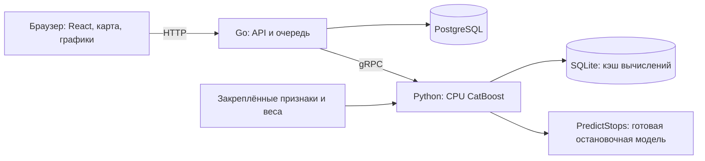

# TramCast — Архитектура и адаптация модели

[Запуск приложения](RUN.md) · [Требования PDF](REQUIREMENTS.md) · [Все материалы](README.md#материалы-для-организаторов)

Go отдаёт интерфейс, справочники и опубликованные прогнозы. Одна задача очереди
соответствует маршруту и полному горизонту версии. После gRPC-ответа Go
проверяет идентификаторы модели, точную часовую сетку и значения, затем одной
транзакцией сохраняет прогноз и успешный статус. Повторные запросы используют
ту же задачу. Python не пишет в PostgreSQL.

`PredictStops` применяет математически обоснованное энтропийное распределение
к тому же маршрутному результату. Модель и gRPC готовы; связь остановочного
ответа с Go-хранилищем и фронтендом пока не реализована.
[Постановка и ограничения](MODEL.md#готовая-модель-прогноза-по-остановкам).

На промахе SQLite-кэша Python действительно запускает CPU-модель на
подготовленных признаках; готовый CSV не служит источником ответа.
Весь горизонт рассчитывается один раз и используется для последующих срезов.
Округление half-up выполняется один раз в Python; суточные и месячные суммы
строятся из опубликованных целых часов.

Поддержаны маршруты 1, 5, 7, 11, 12, 17, 25, 26, 28, 50. Время —
Europe/Moscow, границы запросов — целые часы. Действующий пакет ограничен
ноябрём–декабрём 2025. Масштаб графика не расширяет горизонт модели.

Для новой истории есть [офлайн-подготовка семейства 030](ml/docs/PREPARATION.md)
на следующие 61 сутки. Нужны обновлённые факты и покрывающие внешние снимки.
Новый CPU-пакет требует отдельной подготовки/обучения, проверки и регистрации
версии; автоматического переноса текущих весов на любые даты нет.

Для нового маршрута нужны история успешных валидаций и сведения о её полноте,
идентификаторы и география маршрута, покрывающие календарь, погода и режимы
движения. После обучения и временной проверки расширяются разрешённый набор
маршрутов, справочник и пакет признаков; для остановок также готовятся новые
доли и каталог позиций. Одного добавления линии на карту недостаточно.

Горизонтальное масштабирование Go предусмотрено общим хранилищем и захватом
заданий через `FOR UPDATE SKIP LOCKED`. Проверки конкурентности есть в backend,
но многорепличное развёртывание под нагрузкой не измерялось. Python обслуживает
один закреплённый комплект, SQLite-кэш локален. Автоматического распределения
расчётов между несколькими ML-хостами нет.
