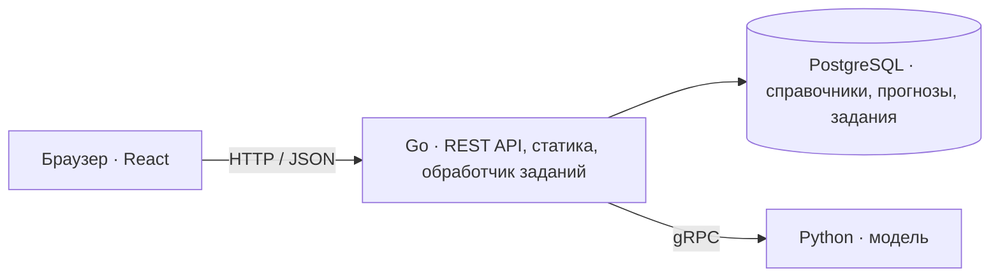

# TramCast

Веб-сервис для прогнозирования пассажиропотока на трамвайных маршрутах Москвы с помощью машинного обучения.

TramCast предназначен для диспетчеров: выбор маршрута и периода, карта остановок и графики прогноза по часам и дням. Прогноз строится по данным успешных валидаций проезда.

**Статус:** готовы SQL-схема, запросы sqlc и окружение PostgreSQL в Docker Compose. Backend пока состоит из каркаса; возможности ниже описывают план MVP.

## Возможности MVP

- Почасовой прогноз по маршруту с просмотром дня, недели и месяца.
- Карта маршрутов и остановок по доступным справочникам.
- Хранение версий прогнозов и фоновый расчёт отсутствующих данных с отображением статуса.

Конкурсный MVP охватывает 10 маршрутов и прогноз на ноябрь–декабрь 2025 года.

## Стек

| Компонент | Технологии |
| --- | --- |
| Backend | Go 1.25, Gin |
| База данных | PostgreSQL, pgx/v5, sqlc, goose |
| ML-сервис | Python, gRPC; ML-фреймворк выбирает команда |
| Frontend | React, TypeScript, Vite, TanStack Query |
| Карта и графики | MapLibre GL JS, Apache ECharts |
| Контракты и запуск | OpenAPI, Protobuf, Docker Compose |

## Архитектура



Go отдаёт готовый фронтенд с диска и читает прогнозы из PostgreSQL. Если данных нет, создаёт задание и возвращает его ID. Фоновый обработчик вызывает Python по gRPC, проверяет результат и сохраняет его одной транзакцией. Повторные запросы к одному маршруту и версии используют общее задание.

Подготовка данных и обучение выполняются отдельно. В развёртывании планируются три сервиса: Go, Python и PostgreSQL.

## Структура проекта

```text
TramCast/
├── backend/     # Go: каркас, SQL-миграции и запросы sqlc
├── frontend/    # React и сборка статики — планируется
├── ml/          # Python-модель и gRPC-сервер — планируется
├── proto/       # Общий Protobuf-контракт — планируется
├── docker-compose.yaml  # PostgreSQL, миграции и локальный доступ к БД
├── Makefile     # Команды разработки
├── AGENTS.md    # Правила разработки и подробный контракт
└── README.md
```

## Разработка

- [Backend: каталоги, первая миграция и генерация sqlc](backend/README.md).
- [Локальная разработка: PostgreSQL, миграции и Makefile](docs/development.md).
- [Контракт проекта: схема БД, API, очередь, требования к данным и ML](AGENTS.md).

Для локальной БД настройте `.env` по `.env.example`, затем выполните `make env-up` и `make migrate-up`. Данные сохраняются в `out/pgdata`. Backend, frontend и ML-сервис будут подключены по мере реализации.
