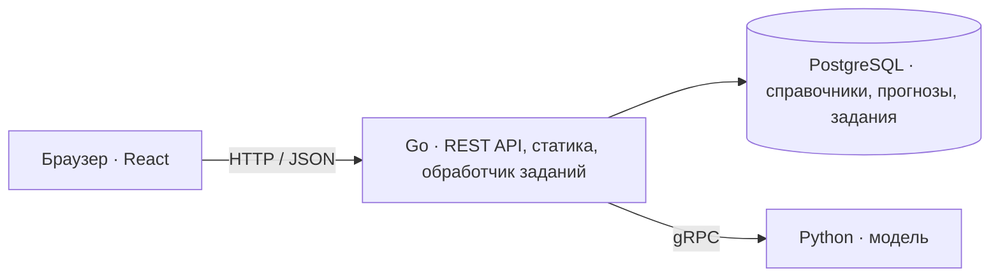

# TramCast

Веб-сервис для прогнозирования пассажиропотока на трамвайных маршрутах Москвы с помощью машинного обучения.

TramCast предназначен для диспетчеров: выбор маршрута и периода, карта остановок и графики прогноза по часам и дням. Прогноз строится по данным успешных валидаций проезда.

**Статус:** готовы SQL-схема, сгенерированный код sqlc/gRPC, Go-сервер со справочниками и схемами маршрутов, импорт справочников из XLSX и снимка OpenStreetMap, прототип интерфейса с картой и графиками на демо-данных прогноза. Прогнозирование и ML-сервис ещё в работе; возможности ниже описывают план MVP.

## Возможности MVP

- Почасовой прогноз по маршруту с просмотром дня, недели и месяца.
- Карта маршрутов и остановок: справочник организаторов, а для маршрутов 17, 25, 26, 28, 50 — снимок OpenStreetMap ([© участники OpenStreetMap](https://www.openstreetmap.org/copyright), ODbL).
- Хранение версий прогнозов и фоновый расчёт отсутствующих данных с отображением статуса.

Конкурсный MVP охватывает 10 маршрутов и прогноз на ноябрь–декабрь 2025 года.

## Стек

| Компонент | Технологии |
| --- | --- |
| Backend | Go 1.26.8, Gin, slog |
| База данных | PostgreSQL, pgx/v5, sqlc, goose |
| ML-сервис | Python, gRPC; ML-фреймворк выбирает команда |
| Frontend | React, TypeScript, Vite, TanStack Query |
| Карта и графики | MapLibre GL JS, Apache ECharts |
| Контракты и запуск | OpenAPI, Protobuf, Docker Compose |

## Архитектура



Go отдаёт готовый фронтенд с диска и читает прогнозы из PostgreSQL. Если данных нет, создаёт задание и возвращает его ID. Фоновый обработчик вызывает Python по gRPC, проверяет результат и сохраняет его одной транзакцией. Повторные запросы к одному маршруту и версии используют общее задание.

Подготовка данных и обучение выполняются отдельно. В развёртывании планируются три сервиса: Go, Python и PostgreSQL.

## Структура проекта

```text
TramCast/
├── backend/     # Go: запуск сервера, SQL-миграции и код sqlc/gRPC
├── data/        # Снимок OpenStreetMap для импорта справочников (ODbL)
├── frontend/    # React + Vite: прототип интерфейса, сборка в dist
├── ml/          # Python-модель и gRPC-сервер — планируется
├── proto/       # Общий Protobuf-контракт Go ↔ Python
├── Dockerfile   # Сборка Go, импортёра и фронтенда в один образ
├── docker/      # Отдельный Dockerfile мигратора Goose
├── docker-compose.yaml  # Приложение, PostgreSQL, миграции и первичный импорт
├── Makefile     # Команды разработки
├── AGENTS.md    # Правила разработки и подробный контракт
├── PRODUCT.md   # Контекст дизайна интерфейса
└── README.md
```

## Разработка

- [Backend: каталоги, первая миграция и генерация sqlc](backend/README.md).
- [gRPC: контракт прогнозирования и генерация Go/Python](proto/README.md).
- [Локальная разработка: PostgreSQL, миграции и Makefile](docs/development.md).
- [Контракт проекта: схема БД, API, очередь, требования к данным и ML](AGENTS.md).

Для запуска нужны Docker с Compose и отдельно полученная книга справочников. Скопируйте `.env.example` в `.env`, задайте пароль PostgreSQL и `CATALOG_HOST_FILE` — путь к книге от корня проекта либо абсолютный путь. Затем:

```text
docker compose up --build -d --wait
```

Compose собирает Go и фронтенд, применяет миграции и загружает справочники в пустую БД перед запуском сервера. Интерфейс открывается на `http://localhost:8080`. Повторный запуск сохраняет данные и пропускает первичный импорт, если справочники уже содержат записи. XLSX подключается только импортёру для чтения и не входит в образ; снимок OSM входит в образ. Данные БД сохраняются в `out/pgdata`.

Для разработки доступны локальный Go (`make run-backend`) и Vite (`make frontend-dev`). Настройка, ручное обновление справочников и диагностика описаны в [инструкции разработки](docs/development.md). Прогнозы интерфейса остаются демонстрационными; API прогнозов и ML-сервис ещё не реализованы.
