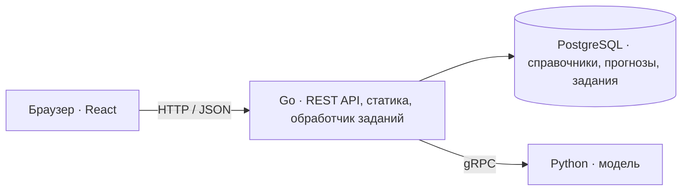

# TramCast

Веб-сервис для прогнозирования пассажиропотока на трамвайных маршрутах Москвы с помощью машинного обучения.

TramCast предназначен для диспетчеров: выбор маршрута и периода, карта остановок и графики прогноза по часам и дням. Прогноз строится по данным успешных валидаций проезда.

**Статус:** готовы SQL-схема, сгенерированный код sqlc/gRPC, Go-сервер со справочниками и схемами маршрутов, импорт справочников из XLSX и снимка OpenStreetMap, прототип интерфейса с картой и графиками на демо-данных прогноза. Python gRPC-сервис пересчитывает рецепт 030 через TabPFN с локальным кэшем. В Go готовы gRPC-клиент, регистрация версий прогноза и очередь расчётов с фоновым обработчиком и транзакционной публикацией; API прогнозов ещё в работе, возможности ниже описывают план MVP.

## Возможности MVP

- Почасовой прогноз по маршруту с просмотром дня, недели и месяца.
- Карта маршрутов и остановок: справочник организаторов, а для маршрутов 17, 25, 26, 28, 50 — снимок OpenStreetMap ([© участники OpenStreetMap](https://www.openstreetmap.org/copyright), ODbL).
- Хранение версий прогнозов и фоновый расчёт отсутствующих данных с отображением статуса.

Конкурсный MVP охватывает 10 маршрутов и прогноз на ноябрь–декабрь 2025 года.

## Стек

| Компонент | Технологии |
| --- | --- |
| Backend | Go 1.26.8, Gin, slog |
| База данных | PostgreSQL, pgx/v5, sqlc, goose |
| ML-сервис | Python, gRPC, TabPFN (рецепт 030), SQLite-кэш |
| Frontend | React, TypeScript, Vite, TanStack Query |
| Карта и графики | MapLibre GL JS, Apache ECharts |
| Контракты и запуск | OpenAPI, Protobuf, Docker Compose |

## Архитектура



Go отдаёт готовый фронтенд с диска и читает прогнозы из PostgreSQL. Если данных нет, создаёт задание и возвращает его ID. Фоновый обработчик вызывает Python по gRPC, проверяет результат и сохраняет его одной транзакцией. Повторные запросы к одному маршруту и версии используют общее задание.

Подготовка данных и обучение выполняются отдельно. В развёртывании планируются три сервиса: Go, Python и PostgreSQL.

## Структура проекта

```text
TramCast/
├── backend/     # Go: запуск сервера, SQL-миграции и код sqlc/gRPC
├── data/        # Очищенная книга справочников и снимок OpenStreetMap (ODbL)
├── frontend/    # React + Vite: прототип интерфейса, сборка в dist
├── ml/          # ML-пайплайн и действующий gRPC-сервер
├── proto/       # Общий Protobuf-контракт Go ↔ Python
├── Dockerfile   # Сборка Go, импортёра и фронтенда в один образ
├── docker/      # Отдельный Dockerfile мигратора Goose
├── docker-compose.yaml  # Приложение, PostgreSQL, миграции и первичный импорт
├── Makefile     # Команды разработки
├── AGENTS.md    # Правила разработки и общие договорённости
├── PRODUCT.md   # Контекст дизайна интерфейса
└── README.md
```

## Разработка

- [ML: запуск сервиса, тесты и результаты](ml/README.md).
- [Backend: каталоги, миграции и генерация sqlc](backend/README.md).
- [gRPC: контракт прогнозирования и генерация Go/Python](proto/README.md).
- [Локальная разработка: PostgreSQL, миграции и Makefile](docs/development.md).
- [Запуск ML и инструкция разработчику backend](ml/docs/HANDOFF.md).
- [Правила проекта и договорённости по данным, API и очереди](AGENTS.md).

Для запуска нужен Docker с Compose. Очищенная книга `data/catalog/catalog.xlsx` и снимок OSM уже находятся в репозитории и входят в образ. Скопируйте `.env.example` в `.env`, задайте пароль PostgreSQL. Затем:

```text
docker compose up --build -d --wait
```

Compose собирает Go и фронтенд, применяет миграции и загружает справочники из образа в пустую БД перед запуском сервера. Интерфейс открывается на `http://localhost:8080`. Повторный запуск сохраняет данные и пропускает первичный импорт, если справочники уже содержат записи. Данные БД сохраняются в `out/pgdata`.

Для разработки доступны локальный Go (`make run-backend`) и Vite (`make frontend-dev`). Настройка, ручное обновление справочников и диагностика описаны в [инструкции разработки](docs/development.md). Прогнозы интерфейса остаются демонстрационными. Очередь Go уже рассчитывает прогнозы через ML и сохраняет их в PostgreSQL при запуске backend на хосте ([порядок](docs/development.md#предварительный-расчёт)), но API прогнозов для интерфейса ещё не реализован. Python-сервис запускается отдельно по [инструкции ML](ml/docs/HANDOFF.md); GPU-профиль `ml` не включается при обычном запуске приложения.
