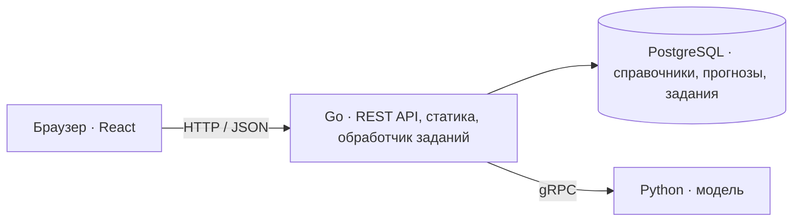

# TramCast

Веб-сервис для прогнозирования пассажиропотока на трамвайных маршрутах Москвы с помощью машинного обучения.

TramCast предназначен для диспетчеров: выбор маршрута и периода, карта остановок и графики прогноза по часам и дням. Прогноз строится по данным успешных валидаций проезда.

## Материалы для организаторов

Начните с [RUN.md](RUN.md): CPU-запуск приложения и проверка прогнозов.
Каждому полю формы соответствует отдельный файл в корне репозитория.

[Соответствие требованиям PDF: статус и проверка каждого пункта](REQUIREMENTS.md).

| Поле формы | Файл |
|---|---|
| Артефакты ML, обучение, inference | [MODEL.md](MODEL.md) |
| Все внешние данные | [EXTERNAL_DATA.md](EXTERNAL_DATA.md) |
| Веб-сервис, Docker, API, инструкция жюри | [RUN.md](RUN.md) |
| Архитектура, область применения, адаптация | [ARCHITECTURE.md](ARCHITECTURE.md) |
| Производительность и дополнительные возможности | [PERFORMANCE.md](PERFORMANCE.md) |
| Ограничения и план развития | [LIMITATIONS.md](LIMITATIONS.md) |

**Статус:** готовы SQL-схема, сгенерированный код sqlc/gRPC, Go-сервер со справочниками и схемами маршрутов, импорт справочников из XLSX и снимка OpenStreetMap, интерфейс с картой и графиками. Python gRPC-сервис рассчитывает маршрутные прогнозы через CPU CatBoost (основной режим) или TabPFN 030 (явный выбор), кэширует результат и выдаёт сценарные оценки по остановкам через `PredictStops`; остановочная интеграция Go/UI ещё не готова. В Go готовы gRPC-клиент, регистрация версий прогноза, очередь расчётов с фоновым обработчиком и транзакционной публикацией и HTTP API прогнозов, который интерфейс использует для расчёта и чтения прогнозов. Конкурсная выгрузка из приложения ещё не готова.

## Возможности MVP

- Почасовой прогноз по маршруту с просмотром дня, недели и месяца.
- Карта маршрутов и остановок: справочник организаторов, а для маршрутов 17, 25, 26, 28, 50 — снимок OpenStreetMap ([© участники OpenStreetMap](https://www.openstreetmap.org/copyright), ODbL).
- Хранение версий прогнозов и фоновый расчёт отсутствующих данных с отображением статуса.

Конкурсный MVP охватывает 10 маршрутов и прогноз на ноябрь–декабрь 2025 года.

**Проверка корректности CPU-поставки:** чистый Docker-запуск и перезапуск
прошли, все 14 640 значений через HTTP совпали с финальным CSV.
[Протокол проверки](docs/verification/README.md).
Замеры производительности будут выполнены на целевом CPU-сервере;
[место для результатов](PERFORMANCE.md#производительность).

## Стек

| Компонент | Технологии |
| --- | --- |
| Backend | Go 1.26.8, Gin, slog |
| База данных | PostgreSQL, pgx/v5, sqlc, goose |
| ML-сервис | Python, gRPC, CPU CatBoost / ручной GPU TabPFN 030, SQLite-кэш |
| Frontend | React, TypeScript, Vite, TanStack Query |
| Карта и графики | MapLibre GL JS, Apache ECharts |
| Контракты и запуск | HTTP API, Protobuf, Docker Compose; OpenAPI ещё не подготовлен |

## Архитектура



Go отдаёт готовый фронтенд с диска и читает прогнозы из PostgreSQL. Если данных нет, создаёт задание и возвращает его ID. Фоновый обработчик вызывает Python по gRPC, проверяет результат и сохраняет его одной транзакцией. Повторные запросы к одному маршруту и версии используют общее задание.

Подготовка данных и обучение выполняются отдельно. Compose запускает три постоянных сервиса: Go, Python CPU ML и PostgreSQL.

## Структура проекта

```text
TramCast/
├── backend/     # Go: запуск сервера, SQL-миграции и код sqlc/gRPC
├── data/        # Очищенная книга справочников и снимок OpenStreetMap (ODbL)
├── frontend/    # React + Vite: интерфейс диспетчера, сборка в dist
├── ml/          # ML-пайплайн и действующий gRPC-сервер
├── proto/       # Общий Protobuf-контракт Go ↔ Python
├── Dockerfile   # Сборка Go, импортёра и фронтенда в один образ
├── docker/      # Отдельный Dockerfile мигратора Goose
├── docker-compose.yaml  # Приложение, PostgreSQL, CPU ML, миграции, импорт и версия прогноза
├── Makefile     # Команды разработки
├── AGENTS.md    # Правила разработки и общие договорённости
├── PRODUCT.md   # Контекст дизайна интерфейса
└── README.md
```

## Разработка

- [ML: запуск сервиса, тесты и результаты](ml/README.md).
- [Backend: каталоги, миграции и генерация sqlc](backend/README.md).
- [gRPC: контракт прогнозирования и генерация Go/Python](proto/README.md).
- [Локальная разработка: PostgreSQL, миграции и Makefile](docs/development.md).
- [Запуск ML и инструкция разработчику backend](ml/docs/HANDOFF.md).
- [Правила проекта и договорённости по данным, API и очереди](AGENTS.md).

Для запуска нужен Docker с Compose. Очищенная книга `data/catalog/catalog.xlsx` и снимок OSM уже находятся в репозитории и входят в образ. Скопируйте `.env.example` в `.env`, задайте пароль PostgreSQL. Затем:

```text
docker compose up --build -d --wait backend ml
docker compose run --rm prediction-jobs-init -wait
```

Compose собирает Go, фронтенд и CPU ML, применяет миграции и загружает справочники из образа в пустую БД. Второй шаг регистрирует версию ML, делает её активной и ждёт расчёта всех 10 маршрутов. GPU не нужна, веса модели входят в репозиторий. Интерфейс открывается на `http://localhost:8080`. Те же шаги выполняет `make app-up`. Повторный запуск сохраняет данные и пропускает первичный импорт, если справочники уже содержат записи. Данные БД сохраняются в `out/pgdata`.

Для разработки доступны локальный Go (`make run-backend`) и Vite (`make frontend-dev`). Настройка, ручное обновление справочников и диагностика описаны в [инструкции разработки](docs/development.md). Интерфейс запрашивает прогнозы через [HTTP API](backend/README.md#http-api-прогнозов); задания рассчитывает backend в контейнере через CPU ML того же Compose. Самостоятельный запуск ML, GPU-рецепт и replay описаны в [инструкции ML](ml/docs/HANDOFF.md) и работают с backend на хосте ([порядок](docs/development.md#предварительный-расчёт)).
