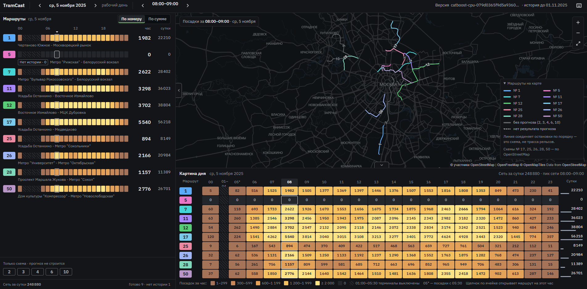

# TramCast: проверка решения

TramCast прогнозирует успешные валидации проезда по десяти трамвайным маршрутам
Москвы на ноябрь–декабрь 2025 года. Веб-интерфейс показывает карту, почасовой
прогноз, суммы по дням и сравнение периодов. Для запуска достаточно CPU.

## Запуск

Нужны Git и работающий Docker с Compose v2. Интернет нужен для первой сборки
и фоновой карты. Python, Go, Node.js и GPU на компьютере проверяющего не нужны.
Вес CPU-модели, признаки и справочники уже находятся в репозитории.

```sh
git clone https://github.com/r0mbeg/TramCast.git
cd TramCast
cp .env.example .env
```

В Windows PowerShell вместо `cp` можно использовать `Copy-Item`.
Задайте непустой `POSTGRES_PASSWORD` в `.env`. Затем из корня репозитория:

```sh
docker compose up --build -d --wait backend ml
docker compose run --rm prediction-jobs-init -wait
```

Если установлен make, то же самое делает `make app-up`.

Первая команда собирает приложение, запускает PostgreSQL и CPU ML, применяет
миграции, импортирует справочники и запускает сервер. Вторая регистрирует версию, ставит задания и ждёт
готовности прогнозов всех десяти маршрутов. Повторный запуск использует прежние
задания и данные. Если запуск завершился ошибкой, проверьте логи командой ниже.

Откройте [http://localhost:8080](http://localhost:8080). Выберите маршрут №12,
дату 1 ноября 2025, затем день, неделю или месяц. У маршрута №5 ожидаются нули
с пояснением об отсутствии истории. За пределами ноября–декабря прогнозов нет.



## Проверка и остановка

- [Готовность HTTP и БД](http://localhost:8080/readyz).
- [Список маршрутов](http://localhost:8080/api/routes).
- [Активная версия модели](http://localhost:8080/api/forecast-versions/active).
- [HTTP API: запрос расчёта, чтение прогноза и статуса](backend/README.md#http-api-прогнозов).

```sh
docker compose ps --all
docker compose logs --tail 50 ml forecast-version-init prediction-jobs-init backend
docker compose down
```

`down` сохраняет БД в `out/pgdata` и кэш ML в Docker volume. Не удаляйте их для
обычного перезапуска. Если порт 8080 занят, измените `HTTP_PORT` в `.env`.
Приложение по умолчанию доступно только с этого компьютера. Для публичного
CPU-сервера нужны отдельный домен, HTTPS и ограничение доступа; готового
публичного адреса в этой поставке нет.

При наличии Python 3 можно проверить все 14 640 значений через HTTP и сравнить
их с финальным CPU CSV:

```sh
python3 scripts/check_release.py
```

## Проверка API

Следующий запрос берёт внутренний ID маршрута №12 из справочника и закрепляет
активную версию. Он выполняется штатным Python внутри ML-контейнера:

```sh
docker compose exec -T ml python -c '
import json
from urllib.request import Request, urlopen
base = "http://backend:8080"
def get(path):
    with urlopen(base + path, timeout=10) as r:
        return json.load(r)
route = next(r for r in get("/api/routes")["routes"] if r["route_number"] == 12)
version = get("/api/forecast-versions/active")
body = {"route_id": route["id"], "forecast_version_id": version["id"],
        "from": "2025-11-01T00:00:00+03:00", "to": "2025-11-02T00:00:00+03:00"}
req = Request(base + "/api/predictions/query", data=json.dumps(body).encode(),
              headers={"Content-Type": "application/json"})
with urlopen(req, timeout=10) as r:
    print(r.status, r.read().decode())
'
```

После завершения запуска ожидается `200` и 24 точки. Если задание ещё считается,
API возвращает `202` с `job_id`; статус читается через
`GET /api/prediction-jobs/{job_id}`. Номер маршрута и его внутренний ID различаются.

## Проверка остановочной модели

Готовая математическая модель доступна в Python; фронтенд её ещё не показывает.
Проверочный запрос на один час:

```sh
docker compose exec -T ml python client.py --stops --route 12 --from 2025-11-01T08:00:00+03:00 --to 2025-11-01T09:00:00+03:00 --timeout 30 --output /tmp/stops12.json
docker compose cp ml:/tmp/stops12.json ./out/stops12.json
```

В JSON есть каталог позиций `occurrences` и массив часов `hours`. Каждый час
содержит массив оценок `estimated_boardings` и исходный итог `route_boardings`.
Также указаны версии модели и данных. Значения массива оценок
соответствуют порядку каталога и в сумме равны маршрутному итогу. Protobuf JSON
представляет int64 строками. Статус `scenario_estimate_unvalidated` означает
сценарный расчёт без измеренной остановочной точности.
[Математическая постановка](MODEL.md#готовая-модель-прогноза-по-остановкам).

## Передача организаторам

[Все шесть материалов для формы](README.md#материалы-для-организаторов).
[Проверка требований PDF по пунктам](REQUIREMENTS.md).
Перед отправкой проверьте доступ к репозиторию без учётной записи разработчика
и закрепите проверенный commit или tag. Локальные правки не доступны по GitHub-ссылке.
