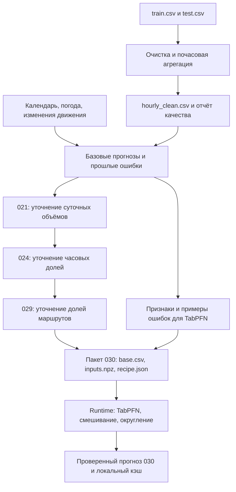

# Текущий подход: от исходных данных до прогноза 030

Состояние описано по файлам проекта на 27 сентября 2026 года. Документ предназначен для коллег и агентов: это карта существующей реализации, а не утверждение о наличии автоматической сквозной пересборки. Нормативные требования находятся в корневом [AGENTS.md](../../AGENTS.md), правила ML — в [ml/AGENTS.md](../AGENTS.md).

## Задача и границы

Предсказываем число успешных валидаций, а не уникальных пассажиров, заполненность вагона или посадки на конкретной остановке. История — январь–октябрь 2025; результат — ноябрь–декабрь 2025, 61 день. Маршруты: 1, 5, 7, 11, 12, 17, 25, 26, 28, 50. Полная сетка результата: 14 640 строк `route;date;hour;prediction`, время Москвы.

Основной вычисляемый рецепт сервиса — **030: TabPFN исправляет почасовой профиль заранее подготовленного прогноза 029**. 002 — контрольный Chronos; 031 — исследовательский кандидат. Номера обозначают варианты конкурсных посылок, а не последовательные обязательные стадии любого ML-пайплайна.

## Общая цепочка

Всё до пакета выполняется офлайн в `lab/`. Runtime не импортирует исследовательские скрипты и не повторяет поиск моделей. Схема показывает основную ветку; дополнительные модели дают признаки и сравнительные прогнозы.

## 1. Исходные события и очистка

Реализация: [pipeline.py](../lab/pipeline.py), функции `prepare` и `aggregate`.

1. Сырые `dataset/train.csv` и `dataset/test.csv` читаются порциями. Период ограничивается временем события: `[2025-01-01, 2025-11-01)`, поскольку файлы содержат хвосты следующего месяца.
2. Проверяются время, маршрут и результат валидации. Посадка — `validation_result == 1`; хеш карты не используется для подсчёта уникальных людей или удаления повторных поездок.
3. До агрегации отбрасываются события вне `[00:00, 01:00)` и `[05:30, 24:00)`. Час 5 содержит только события с 05:30.
4. Считаются исходные успешные события, очищенные успешные события и все рабочие события по маршруту, дате и часу. Маршрут 5 имеет согласованный нулевой fallback.
5. На стыке файлов проверяются потенциальные совпадения по пяти полям за 1 сентября; при совпадениях подготовка останавливается для разбора. Это не полная дедупликация всех сырых событий.
6. Исходные агрегаты до очистки сверяются с предоставленными labels. Несовпадение останавливает подготовку.

Результат — `lab/artifacts/hourly_clean.csv`: 72 960 строк (10 × 304 × 24), счётчики и признаки наличия наблюдений. Рядом сохраняются `preparation_audit.json`, `label_mismatches.csv`, `cleaning_by_route_hour.csv`, `prepare_run.json`.

**Ограничение реализации:** отсутствующие счётчики в полной сетке заполняются нулями; признаки наблюдаемости сохраняются отдельно. Отсутствие событий не доказывает нулевой спрос или полноту регистрации. Подготовка не выполняет полноценного восстановления всех пропусков. Не описывать эту таблицу как полностью подтверждённую историю спроса. Аудит ограничений — [DATA_REPORT.md](../lab/artifacts/methodology_20260927/data/DATA_REPORT.md).

## 2. Внешние данные и производные признаки

| Источник | Использование |
|---|---|
| Очищенная история | Суточные суммы, часовые доли, недавние уровни и ошибки прогнозов |
| Производственный календарь | День недели, рабочие дни, праздники и переносы |
| Школьный календарь | Шесть признаков каникул и расстояния до их границ; ориентир, не календарь всех пассажиров |
| Архив Open-Meteo/ERA5 за 2025 год | Средняя температура, осадки, продолжительность дня |
| Объявления об изменениях движения | Выделение периодов ограничений и поправки для соответствующих маршрутов |
| Прогнозы вспомогательных моделей | Расхождения с базой, используемые при коррекции ошибок; в том числе TimesFM, Ridge и другие исследовательские варианты |

Погода включает ноябрь–декабрь: это **разрешённый ретроспективный конкурсный режим**, а не прогноз погоды, доступный на 31 октября. Ограничение относится и к оценке применимости всей составной модели. Будущие целевые валидации ноября–декабря не используются. Для календарей код отдельно проверяет даты доступности источников; нельзя переносить эту гарантию автоматически на все внешние сведения.

Реализация и происхождение: [погодные признаки](../lab/experiments/portfolio_weather_volume.py), [метаданные архива погоды](../lab/artifacts/portfolio_20260926/continuation/external/weather_source.json), [движение](../lab/experiments/portfolio_operations.py), [школьный календарь](../lab/experiments/portfolio_school_fraction.py).

XLSX-справочники и снимок OSM не входят в признаки текущего рецепта. Их использование для карты не означает использования в модели. Изучение этих источников выполнено, но подтверждённого эксперимента по улучшению 030 географическими признаками здесь не зафиксировано.

## 3. Примеры прошлых ошибок и цепочка до 029

Корректирующие модели обучаются на результатах прогнозов из прошлых точек отсечения. Для каждой точки прогноз строится по доступной истории посадок, затем сравнивается с фактом. Для обучения корректора используются завершённые окна, факты которых уже доступны к его дате отсечения. Это ограничение целевых данных не отменяет ретроспективность внешних источников.

Основная ветка:

| Этап | Что делает |
|---|---|
| Базовые модели | Оценивают суточные объёмы и часовые профили, учитывают календарь, погоду и движение |
| 021 | Уточняет суточные объёмы через байесовскую модель прошлых ошибок и контекста; включает исправленные даты изменений движения |
| 024 | Исправляет часовые доли через BayesianRidge, смешивая исходный и исправленный профиль 50/50; суточные объёмы сохраняются до округления |
| 029 | Градиентный бустинг по 30 признакам, включая школьный календарь, корректирует дневные доли маршрутов. Исправленное распределение смешивается с 024 в долях 50/50 |

029 сохраняет общий дневной объём по целевым маршрутам и часовые доли 024 внутри каждого маршрута. Суточные объёмы отдельных маршрутов меняются. 028 — предшествующий вариант коррекции без школьных признаков и контроль эксперимента; выбранный 029 не требует последовательного применения поправки 028 поверх 024.

Связи вариантов и результаты — [SOLUTIONS.md](../lab/SOLUTIONS.md). Код 029 — [portfolio_school_fraction.py](../lab/experiments/portfolio_school_fraction.py); сохранённый аудит — [archive_029.json](../lab/artifacts/portfolio_20260926/continuation/archive_029.json). Исторические отчёты могут называть 031 текущим лидером поиска; выбор для рабочего сервиса зафиксирован отдельно как 030.

## 4. Подготовленный пакет 030

Реализация подготовки признаков — [portfolio_tabular_shape.py](../lab/experiments/portfolio_tabular_shape.py). Состав поставки — [README рецепта](../recipes/tabpfn-030/README.md).

| Файл | Содержимое |
|---|---|
| `recipes/tabpfn-030/base.csv` | Заранее рассчитанный прогноз 029 до округления |
| `recipes/tabpfn-030/inputs.npz` | Обучающие признаки X (3559 × 50), признаки будущих дней, координаты прошлых ошибок, средняя ошибка, шесть компонент базиса, исходные часовые доли и маска активных дней маршрутов |
| `recipes/tabpfn-030/recipe.json` | Период, хеши входов и весов, настройки устройства и расчёта, поколение |
| `models/tabpfn-v2-regressor.ckpt` | Отдельно устанавливаемые закреплённые веса TabPFN; не коммитятся |

50 признаков состоят из 30 дневных признаков и 20 исходных часовых долей (час 0 и часы 5–23). Ошибки часовых долей представлены шестью компонентами; TabPFN предсказывает поправки к их координатам. В `inputs.npz` нет сохранённых финальных предсказаний TabPFN.

029 и признаки должны быть согласованно пересобраны. Нельзя заменить только дату или хеш истории в JSON и считать входы обновлёнными.

## 5. Расчёт, выдача и публикация

В вычисляемом режиме runtime проверяет пакет и веса. При отсутствии результата в локальном SQLite-кэше выполняет TabPFN fit/predict на подготовленных примерах, восстанавливает поправку часовых долей и нормализует профиль. Fit здесь задаёт контекст готовой foundation-модели, а не повторяет её предобучение.

Исправленный профиль смешивается с 029 в долях 50/50 с сохранением суточных объёмов до округления. Затем выполняется единственное финальное округление half-up, неотрицательность и обязательные нули маршрута 5 и часов 1–4. Проверяется полная сетка 14 640 строк. Повторные запросы читают кэш, запрос отдельного среза не запускает новый полный расчёт при готовом кэше. Для маршрута 5 предусмотрен ответ без модели.

Код — [model_030.py](../runtime/model_030.py); проверки реального расчёта — [VALIDATION.md](VALIDATION.md). Отдельный режим replay выдаёт сохранённый bundle без вызова модели; его нельзя представлять как пересчёт. Запуск и передача — [ML README](../README.md), [HANDOFF.md](HANDOFF.md).

По архитектурному контракту Go/PostgreSQL владеет заданиями и опубликованными версиями, SQLite — только кэш ML. Это разделение ответственности не означает, что вся интеграция Go/UI уже завершена. Контракт взаимодействия — [INTEGRATION.md](INTEGRATION.md).

## Что можно воспроизвести и чего пока нет

- Расчёт финального 030 из подготовленного пакета реализован и проверен отдельно. Совпадение результата с прежней посылкой не является новой независимой оценкой качества.
- Полной автоматической команды «сырые данные → весь набор родительских моделей → новый пакет 030» в runtime нет. Офлайн-цепочка состоит из лабораторных скриптов и сохранённых промежуточных файлов.
- Этот документ не заменяет проверенную инструкцию сквозной пересборки. Для неё ещё нужно закрепить порядок всех зависимостей, команды, среды, необходимые локальные артефакты и проверку конечного пакета. Некоторые исторические команды содержат прежние пути и кластерное окружение; см. [правила полигона](../lab/README.md).
- Смена поколения через ручной refresh повторяет финальный расчёт на тех же входах. Она не обновляет историю, внешние источники или базовый 029.
- Текущие входы покрывают только ноябрь–декабрь 2025. Новый период, новая история или годовой горизонт требуют пересборки и отдельной проверки применимости.
- Исторические окна уже использовались для выбора вариантов. Не выдавать их метрики за независимый тест; фактических валидаций ноября–декабря для собственной проверки нет.

## Как поддерживать описание

При изменении выбранного рецепта, источников, очистки, состава признаков или границы между офлайн-подготовкой и runtime обновлять этот документ вместе с реализацией. Хранить происхождение, настройки и контрольные суммы нового пакета; старые результаты исследований не перезаписывать. Документирование текущего состояния не является поручением запускать старые задания или заново подбирать модель.
